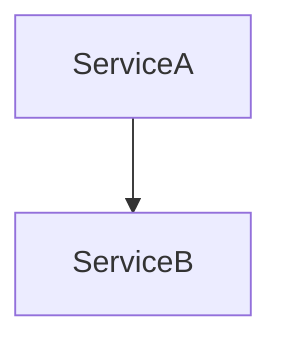

# Copilot Instructions — ML & DL Fundamentals Guide

This is an MkDocs documentation site covering Machine Learning and Deep Learning fundamentals for learners preparing for AI/ML roles and understanding the foundation for advanced topics like LLMs and AI agents.

---

## Project Structure

```
mlDLGuide/
├── mkdocs.yml                          ← Site config and nav
├── requirements.txt                    ← Python deps (mkdocs + pymdown)
├── docs_extensions.py                  ← Custom Mermaid preprocessor
├── docs/
│   ├── index.md                        ← Master overview + learning path
│   ├── _abbreviations.md               ← Glossary for hover tooltips
│   ├── js/
│   │   ├── mermaid-init.js             ← Mermaid diagram renderer
│   │   ├── mathjax.js                  ← Math formula initialization
│   │   └── tooltips.js                 ← Hover tooltip engine
│   ├── css/
│   │   └── myCss.css                   ← Custom styling
│   ├── 00-ml-fundamentals.md           ← Supervised/unsupervised learning overview
│   ├── 00.01-supervised-unsupervised.md ← Classification vs regression deep dive
│   ├── 00.02-core-concepts.md          ← Gradient descent, optimization, regularization
│   ├── 01-neural-networks.md           ← Perceptrons, layers, basics
│   ├── 01.01-perceptrons-activation.md ← Activation functions deep dive
│   ├── 01.02-backpropagation.md        ← Backpropagation algorithm deep dive
│   ├── 02-deep-learning-overview.md    ← Why depth works, hierarchical features
│   ├── 02.01-cnn.md                    ← Convolutional neural networks
│   ├── 02.02-rnn.md                    ← Recurrent neural networks
│   ├── 02.03-transformer.md            ← Transformer architecture (foundation of LLMs)
│   ├── 03-optimization-training.md     ← Training strategies and learning schedules
│   ├── 03.01-regularization.md         ← Preventing overfitting
│   ├── 03.02-transfer-learning.md      ← Pre-training and fine-tuning
│   ├── 04-word-embeddings.md           ← Semantic vector representations
│   ├── 04.01-embedding-models.md       ← Word2Vec, GloVe, FastText
│   ├── 05-ml-pipeline.md               ← End-to-end project workflow
│   ├── 05.01-data-preprocessing.md     ← Data cleaning and preparation
│   ├── 05.02-feature-engineering.md    ← Feature creation and selection
│   ├── 06-math-reference.md            ← Mathematical formulas and notation
│   └── 07-interview.md                 ← Interview Q&A (50+ questions)
```

---

## How to Add or Expand Content

### Add a new top-level section
1. Create `docs/NN-section-name.md`
2. Add an entry to `nav:` in `mkdocs.yml`
3. Follow the content style guide below

### Add a sub-article within an existing section
When a topic grows large enough to split, use a numbered sub-file pattern:
1. Create `docs/NN-section-name.md` for the main article (e.g. `02-deep-learning-overview.md`)
2. Create `docs/NN.01-topic-name.md` for the sub-article (e.g. `02.01-cnn.md`)
3. Update `nav:` in `mkdocs.yml`:
```yaml
- Deep Learning Architectures:
  - "02 · Deep Learning Overview": 02-deep-learning-overview.md
  - "02.01 · Convolutional Neural Networks": 02.01-cnn.md
  - "02.02 · Recurrent Neural Networks": 02.02-rnn.md
```

---

## Deep-Dive Article Pattern (Summary + Sub-articles)

The site uses a **two-tier content model**:

- **`NN-section.md`** — the summary: breadth-first, tables, quick reference. **Never remove or modify existing content here.** Only add `→ Deep Dive:` links.
- **`NN.XX-topic.md`** — focused deep-dives: one topic per file, progressively deeper.

### How 02-Deep Learning Was Structured (Reference Implementation)

02-deep-learning-overview.md is the summary. The sub-articles are:
- 02.01-cnn.md
- 02.02-rnn.md
- 02.03-transformer.md

**Step 1 — Identify major topic clusters in the summary.**

For 02-deep-learning these are: CNNs, RNNs, Transformers (and potentially more like Attention, Vision Transformers, etc.).

**Step 2 — Create one sub-article per cluster**, numbered `NN.01`, `NN.02`, etc:

```
02-deep-learning-overview.md    ← summary, untouched
02.01-cnn.md
02.02-rnn.md
02.03-transformer.md
```

**Step 3 — Add a `→ Deep Dive:` link** at the end of each corresponding section in the summary:

```markdown
## Convolutional Neural Networks (CNNs)

... (existing summary content unchanged) ...

→ **[Deep Dive: CNNs](02.01-cnn.md)** — Convolutions, pooling, filters, receptive fields, architectural variants
```

**Step 4 — Structure each sub-article** with this template:

```markdown
# Topic Name — Deep Dive

> **Level:** Beginner | Intermediate | Advanced
> **Pre-reading:** [NN · Parent Summary](NN-section.md) · [NN.XX · Related Article](NN.XX-related.md)

---

## Section 1 ...

## Section 2 ...

---

??? question "Interview question about this topic?"
    Concise answer, 2–4 lines.
```

**Step 5 — Add all sub-articles to `mkdocs.yml`** under the same nav group as the summary:

```yaml
- Deep Learning Architectures:
  - "02 · Deep Learning Overview": 02-deep-learning-overview.md
  - "02.01 · CNNs": 02.01-cnn.md
  - "02.02 · RNNs": 02.02-rnn.md
  - "02.03 · Transformers": 02.03-transformer.md
```

### Learning Level Guidelines

| Level | Who It's For | Depth |
|:------|:------------|:------|
| **Beginner** | Concepts new to the reader | Definitions, diagrams, why it exists |
| **Intermediate** | Reader knows the concept, wants practical detail | Trade-offs, patterns, code examples, common mistakes |
| **Advanced** | Reader wants production-grade knowledge | Full flows, security vulnerabilities, configuration, comparisons |

### Sub-article Content Rules

- Always start with `> **Level:**` and `> **Pre-reading:**` breadcrumb links
- Include at least one Mermaid diagram per sub-article
- End with 2–3 `??? question` interview Q&A blocks
- Keep to the topic of the file — cross-link to other sub-articles rather than duplicating content
- Use `!!! tip`, `!!! warning`, `!!! note` callouts for key insights and gotchas

### Add a Mermaid diagram
Use triple-backtick mermaid blocks:
````

````

---

## Content Style Guide

**Goal:** Breadth over depth, with mathematical rigor. This is a fundamentals guide, not a research paper.

| Element                                    | Usage                                                                             |
|:-------------------------------------------|:----------------------------------------------------------------------------------|
| **Tables**                                 | Primary format for concept comparisons and definitions. Keep columns left aligned |
| **Mermaid diagrams**                       | Architecture flows, neural network structures, data pipelines, state machines     |
| **Math formulas (MathJax)**                | LaTeX for mathematical notation and derivations                                  |
| **`??? question`**                         | Collapsible interview Q&A blocks                                                  |
| **`!!! tip` / `!!! note` / `!!! warning`** | Callout boxes for key insights, examples, and common mistakes                    |
| **Bold**                                   | First occurrence of a key term                                                    |
| **Description length**                     | 1–2 lines per concept maximum                                                     |

### Admonition blocks
```markdown
!!! tip "Title"
    Key insight or recommendation.

!!! warning "Watch out"
    Common mistake or gotcha.

!!! note "Example"
    Concrete example or use case.

??? question "Interview question text?"
    Short answer, 2–4 lines maximum.
```

---

## Markdown List Rendering Rule

**Always add a blank line between a text/paragraph and the list that follows it.**

MkDocs (and most Markdown renderers) require a blank line before a list to render it correctly as a `<ul>` or `<ol>`. Without it, the list items render inline as plain text.

❌ **Wrong — no blank line before list:**
```markdown
**Benefits:**
- Better accuracy
- Faster training
- Easier to interpret
```

✅ **Correct — blank line before list:**
```markdown
**Benefits:**

- Better accuracy
- Faster training
- Easier to interpret
```

This applies everywhere:
- After a **bold label** like `**Advantages:**`, `**When used:**`, `**Properties:**`
- After a sentence or paragraph that introduces a list
- After a `>` blockquote that introduces a list
- Does NOT apply inside code blocks, YAML, or math formulas

---

## Mermaid Diagram Rules

1. **NEVER use `|` inside node labels** `[ ]` — it breaks the mermaid parser. Use `·` (middle dot U+00B7) instead: `[Layer 0 · 64 neurons]`
2. Supported start keywords: `graph`, `sequenceDiagram`, `classDiagram`, `stateDiagram`, `erDiagram`, `pie`, `gitGraph`
3. Keep diagrams simple — maximum ~10–12 nodes for rendering reliability
4. Test all diagrams in live preview (`mkdocs serve`) before finalizing
5. Use `-.->` for dotted edges: `A -.-> B` (dotted), `A --> B` (solid)
6. Use `<br/>` for line breaks in node labels: `["Layer<br/>Normalization"]`

### Mermaid Rendering

The site uses a custom preprocessor (`docs_extensions.py`) to convert Mermaid code blocks. All `\`\`\`mermaid` blocks are automatically converted to `<div class="mermaid">` format for proper Mermaid.js rendering. **No additional setup needed — just write your diagrams normally!**

---

## Build & Serve Commands

```bash
# First-time setup
python3 -m venv .venv
source .venv/bin/activate
pip install -r requirements.txt

# Local preview (hot reload with Mermaid & MathJax support)
python3 -m mkdocs serve
# → http://127.0.0.1:8000

# Production build
python3 -m mkdocs build
# → output in site/
```

---

## Mathematical Formulas

Use **inline MathJax** for formulas. The site is configured with `pymdownx.arithmatex:generic: true`.

### Inline formulas
```markdown
The gradient is computed as $\nabla L = \frac{\partial L}{\partial w}$.
```

### Display formulas (block)
```markdown
$$
\text{Loss} = \frac{1}{n} \sum_{i=1}^{n} (y_i - \hat{y}_i)^2
$$
```

---

## Adding Abbreviations & Tooltips

The site uses **hover tooltips** for technical terms — when readers hover over a dotted-underlined term, a popup shows its definition. This is powered by the `abbr` Markdown extension + a custom JavaScript tooltip engine.

### How It Works

1. **`docs/_abbreviations.md`** — Shared glossary file containing all term definitions (70+ ML/DL terms)
2. **`docs/js/tooltips.js`** — JavaScript that renders floating tooltips on hover (works inside tables!)
3. **Any page** can include abbreviations by adding one line at the bottom: `--8<-- "_abbreviations.md"`

### Adding a New Abbreviation — Step by Step

#### Step 1: Add the definition to `docs/_abbreviations.md`

Open `docs/_abbreviations.md` and add your term in the relevant section (or create a new comment section if needed):

```markdown
<!-- Your section category (e.g., "Loss Functions", "Activation Functions", etc.) -->
*[Your Term]: Your definition here — 1–2 lines, concise and clear.
*[alternate form]: Same definition if the term appears in lowercase or different format.
```

**Example — adding "Backpropagation":**
```markdown
<!-- Neural Network Training -->
*[Backpropagation]: Algorithm for computing gradients via chain rule; enables efficient training of deep networks.
*[backpropagation]: Algorithm for computing gradients via chain rule; enables efficient training of deep networks.
```

**Rules:**
- **One definition per term** — the JavaScript will display it on every match
- **Add case variants** if the term appears as both "ReLU" and "relu" or "Sigmoid" and "sigmoid" (the extension is case-sensitive)
- **Keep definitions 1–2 lines max** — concise over verbose
- **Include key context** — "what it is" + "why it matters"
- **Use categories** with HTML comments to organize: `<!-- Loss Functions -->`, `<!-- Optimization -->`, etc.

#### Step 2: Include abbreviations on your page

At the **very end** of your markdown file (after all content, after interview Q&As), add:

```markdown
--8<-- "_abbreviations.md"
```

This line tells MkDocs to include all abbreviations from that shared file. The `abbr` extension will automatically wrap every matching term with `<abbr title="...">` tags.

#### Step 3: Rebuild and test

Run the dev server:
```bash
source .venv/bin/activate
python3 -m mkdocs serve
```

Then open the page at `http://127.0.0.1:8000/` and look for **dotted-underlined terms**. Hover over one — you should see a dark tooltip bubble appear above the term with its definition.

### Adding Abbreviations to a New Page — Full Example

Say you're writing `docs/08-llm-fundamentals.md` and want to add tooltips for terms like **Transformer**, **Attention**, **Token**.

**In `docs/_abbreviations.md`, add:**

```markdown
<!-- Large Language Models -->
*[Transformer]: Neural network architecture based on self-attention; foundation of modern LLMs like GPT.
*[transformer]: Neural network architecture based on self-attention; foundation of modern LLMs like GPT.
*[Attention]: Mechanism that weighs input elements; enables models to focus on relevant parts of the input.
*[attention]: Mechanism that weighs input elements; enables models to focus on relevant parts of the input.
*[Token]: Atomic unit of text; typically a word or subword (e.g., "Hello" → ["He", "llo"]).
*[token]: Atomic unit of text; typically a word or subword (e.g., "Hello" → ["He", "llo"]).
```

**In `docs/08-llm-fundamentals.md`, at the bottom:**

```markdown
## Understanding Transformers

Discussion of **Transformer** architecture, **Attention** mechanisms, and **Token** processing...

--8<-- "_abbreviations.md"
```

Now every occurrence of "**Transformer**", "**Attention**", "**Token**" (and their lowercase variants) will have tooltips.

### Visual Styling

- **Dotted underline** (✓ visible, shows term is hoverable)
- **`cursor: help`** icon on hover
- **Dark tooltip bubble** (position: fixed, follows cursor, auto-flips at screen edges)
- **Works inside tables** — the JavaScript appends the tooltip to `<body>`, so it's never clipped by `overflow: hidden`

### Glossary Table (Optional)

Many pages include a **Glossary** section at the bottom before the abbreviations include:

```markdown
## Glossary

Key terms used on this page — hover over any **underlined** term throughout the article to see its definition inline.

| Term | Definition |
|:-----|:-----------|
| **Transformer** | Neural network architecture based on self-attention; foundation of modern LLMs. |
| **Attention** | Mechanism that weighs input elements; enables focus on relevant parts. |
| **Token** | Atomic unit of text; typically a word or subword. |

--8<-- "_abbreviations.md"
```

This gives readers both a **reference table** at the bottom and **inline tooltips** throughout the page.

---

## Adding Interview Questions

In `docs/07-interview.md`, append to the Q&A section:

```markdown
??? question "What is X and why does it matter?"
    Concise answer in 2–4 lines. Include the key distinction or gotcha.
```


---

## Tone & Voice

- **Learner-to-learner**; explain concepts from first principles
- **Balance intuition and rigor**: Start with intuition, provide mathematical notation for precision
- Prefer **concrete examples** over abstract descriptions
- Use **past tense for events** ("The error decreased"), **present tense for concepts** ("Gradient descent finds local minima")
- **Assume foundational knowledge**: Linear algebra, calculus, basic Python — but explain ML concepts from scratch

---

## Custom Extensions

### docs_extensions.py (Mermaid Preprocessor)

This file contains a custom Markdown preprocessor that converts Mermaid code blocks from the default `<pre><code>` format to `<div class="mermaid">` format, which Mermaid.js can properly render.

**How to use:**
- Just write `\`\`\`mermaid` blocks normally
- The preprocessor handles HTML conversion automatically
- Register in `mkdocs.yml` under `markdown_extensions`: `- docs_extensions`

**Technical details:**
- Python Markdown extension using `Preprocessor` base class
- Regex-based line parsing
- Registered in markdown pipeline with priority 30

---

## Common Workflows

### Adding a new diagram to an existing page
1. Find the section where you want the diagram
2. Add a `\`\`\`mermaid` block
3. Write your diagram
4. Test with `mkdocs serve`
5. Diagram automatically renders!

### Adding a mathematical formula to an article
1. Use `$...$` for inline formulas: `The loss is $L = \frac{1}{n} \sum (y - \hat{y})^2$`
2. Use `$$...$$` for display formulas (on their own line)
3. MathJax automatically renders via `mathjax.js`

### Adding a collapsible Q&A
```markdown
??? question "What is backpropagation?"
    Algorithm that computes gradients by applying the chain rule backwards through the network. Enables efficient training.
```

---

## Troubleshooting

### Diagrams not rendering?
1. Hard refresh browser: `Cmd+Shift+R` (Mac) or `Ctrl+Shift+R` (Windows/Linux)
2. Check browser console (F12) for errors
3. Verify `docs_extensions.py` is in project root and registered in `mkdocs.yml`

### Math formulas not rendering?
1. Check syntax: Use `$...$` for inline, `$$...$$` for display
2. Verify `mathjax.js` is loaded in `extra_javascript`
3. Clear browser cache and hard refresh

### Abbreviations/tooltips not showing?
1. Verify `--8<-- "_abbreviations.md"` is at the end of your markdown file
2. Check that terms are defined in `_abbreviations.md`
3. Hard refresh browser
4. Check browser console for JavaScript errors

---

## Example Article Template

```markdown
# Topic Name — Deep Dive

> **Level:** Beginner | Intermediate | Advanced
> **Pre-reading:** [00 · ML Fundamentals](00-ml-fundamentals.md) · [01 · Neural Networks](01-neural-networks.md)

---

## Introduction

Brief overview of what this article covers and why it matters.

## Key Concept 1

Explanation with:
- Definition
- Intuition
- Mathematical notation
- Example

## Key Concept 2

...

## Common Mistakes

!!! warning "Watch out"
    Common pitfall or misconception.

## Interview Questions

??? question "What is X?"
    Concise answer, 2–4 lines.

??? question "When would you use X vs Y?"
    Brief comparison with trade-offs.

---

## Glossary

Key terms used on this page.

| Term | Definition |
|:-----|:-----------|
| **Term 1** | Definition 1 |
| **Term 2** | Definition 2 |

--8<-- "_abbreviations.md"
```

---

## Summary

**Key files:**
- `mkdocs.yml` — Configuration and navigation
- `docs_extensions.py` — Custom Mermaid preprocessor
- `docs/*.md` — Your content
- `docs/_abbreviations.md` — Glossary for tooltips
- `docs/js/` — Mermaid, MathJax, and tooltip rendering

**Quick start:**
```bash
python3 -m mkdocs serve
```

**Remember:**
- Use Mermaid for diagrams (automatic rendering)
- Use MathJax for formulas (LaTeX syntax)
- Use abbreviations for glossary terms (automatic tooltips)
- Blank line before lists
- No `|` in Mermaid node labels
- Two-tier content model (summary + deep-dives)
