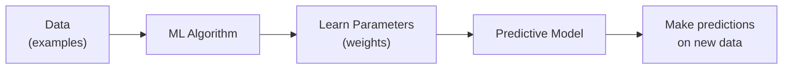
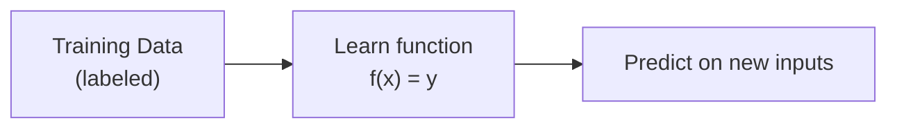
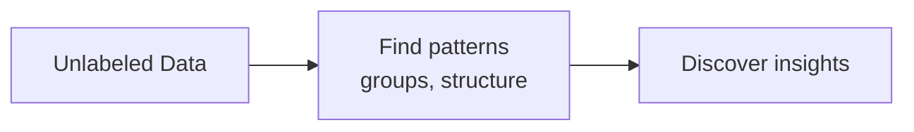
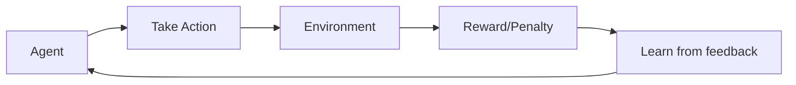
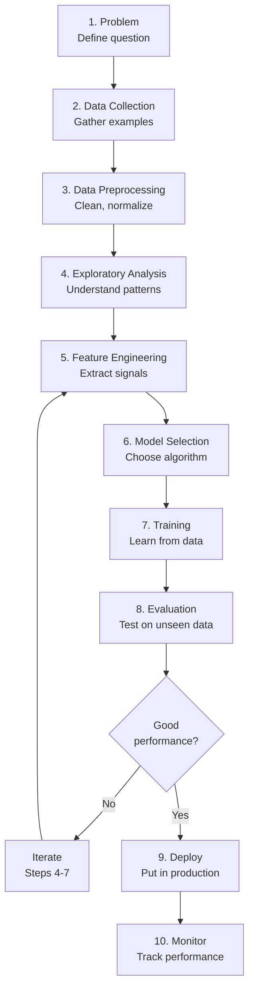
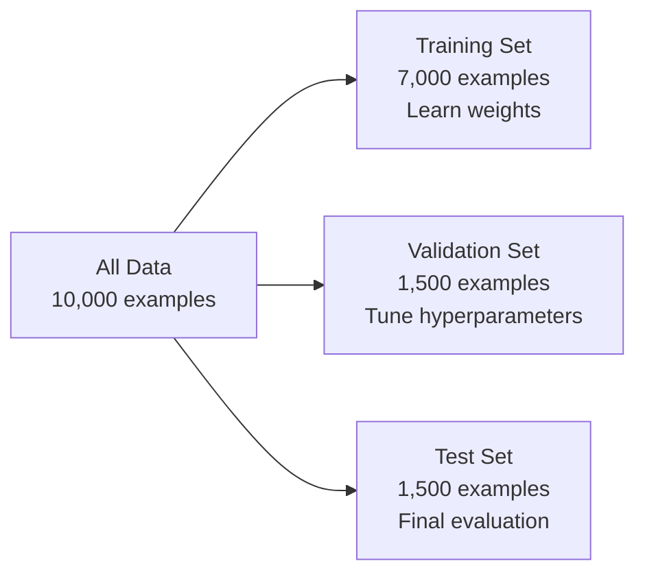
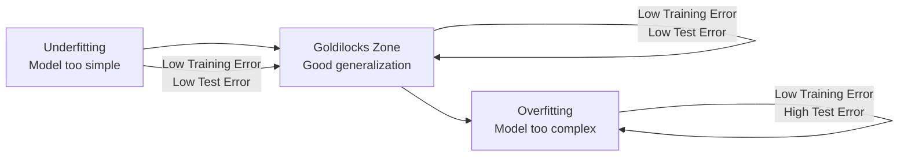

# 00 · Machine Learning & Deep Learning Fundamentals { #ml-fundamentals }

> **Level:** Beginner  
> **Pre-reading:** None — this is the starting point

---

## What is Machine Learning?

**Machine Learning (ML)** is a computational approach where systems **learn patterns from data** rather than being explicitly programmed. Instead of writing rules like `if (temperature > 100) then alert()`, we feed the system thousands of examples and let it discover the underlying patterns.



**Traditional Programming:**
```
if house_size > 5000: price = 500000
else: price = 300000
```

**Machine Learning:**
```
model.train(houses_with_prices)  # Learn from examples
predicted_price = model.predict(new_house)  # Generalize to new data
```

---

## Three Main Types of Machine Learning

### 1. Supervised Learning

You provide **labeled examples**: input → correct output pairs. The model learns to map inputs to outputs.

| Type | Input → Output | Examples |
|:-----|:---------------|:---------|
| **Regression** | House features → Price | Stock price prediction, temperature forecasting |
| **Classification** | Email text → Spam/Not Spam | Email filtering, disease diagnosis, image classification |



**Use when:** You have lots of labeled examples and want to predict a specific output.

### 2. Unsupervised Learning

You provide **unlabeled data**. The model finds hidden patterns or structure.

| Type | What It Does | Examples |
|:-----|:------------|:---------|
| **Clustering** | Group similar data points together | Customer segmentation, grouping news articles |
| **Dimensionality Reduction** | Reduce data to essential features | Compression, visualization |
| **Anomaly Detection** | Find unusual data points | Fraud detection, equipment failure detection |



**Use when:** You have data but no labels; you want to explore structure or find anomalies.

### 3. Reinforcement Learning

The model **learns through trial-and-error** with rewards and penalties.



**Examples:** Game AI (chess, Go), robotics, autonomous driving, recommendation systems

---

## The Machine Learning Pipeline

Every ML project follows a general pipeline:



### Detailed Pipeline Phases

| Phase | What Happens | Output | Example |
|:------|:------------|:-------|:--------|
| **Problem Definition** | Understand the business question | Problem statement | "Predict house prices from features" |
| **Data Collection** | Gather raw examples | Raw dataset | 10,000 house listings with features & prices |
| **Preprocessing** | Clean, handle missing values, normalize | Clean dataset | Remove outliers, fill NaNs, scale features to [0,1] |
| **Exploratory Analysis** | Visualize, understand patterns | Insights | "House size strongly correlates with price" |
| **Feature Engineering** | Select/create relevant features | Feature matrix | Extract bed/bath counts, compute price-per-sqft |
| **Data Split** | Divide into train/val/test | Three datasets | Train: 70%, Val: 15%, Test: 15% |
| **Model Selection** | Choose algorithm | Architecture | "Use linear regression vs decision tree" |
| **Training** | Adjust parameters to minimize error | Learned model | Model with optimized weights |
| **Evaluation** | Measure on unseen test data | Metrics | Accuracy: 92%, MSE: 15000 |
| **Deployment** | Move model to production | Live service | API endpoint making predictions |
| **Monitoring** | Track performance, retrain if needed | Feedback loop | Monitor prediction accuracy over time |

---

## Data Splitting: Train, Validation, Test

Proper data splitting is **critical** to avoid overfitting (the model memorizing training data instead of learning general patterns).



| Set | Purpose | Size | Used When |
|:----|:--------|:-----|:----------|
| **Training Set** | Learn model parameters | 60–80% | Training, optimization |
| **Validation Set** | Tune hyperparameters, early stopping | 10–20% | During training, choosing learning rate, batch size |
| **Test Set** | Final unbiased evaluation | 10–20% | Once, after training is complete |

!!! warning "Test Set Sacred"
    Never use the test set during training. It must remain completely unseen until final evaluation, or your performance metrics will be overly optimistic.

---

## Key Metrics for Evaluation

### Classification (predicting categories)

| Metric | Formula | Interpretation | When to Use |
|:-------|:--------|:--------------|:-----------|
| **Accuracy** | $\frac{TP + TN}{TP + TN + FP + FN}$ | % of correct predictions | Balanced datasets |
| **Precision** | $\frac{TP}{TP + FP}$ | Of predicted positives, how many were right? | When false positives are costly |
| **Recall (Sensitivity)** | $\frac{TP}{TP + FN}$ | Of actual positives, how many did we find? | When false negatives are costly |
| **F1 Score** | $2 \cdot \frac{\text{Precision} \times \text{Recall}}{\text{Precision} + \text{Recall}}$ | Harmonic mean of precision & recall | Imbalanced datasets |

Where: TP = True Positive, TN = True Negative, FP = False Positive, FN = False Negative

**Example: Email spam detector**
- **Precision:** Of emails marked spam, how many were actually spam? (false positives = missed important emails)
- **Recall:** Of actual spam emails, how many did we catch? (false negatives = spam in inbox)

### Regression (predicting continuous values)

| Metric | Formula | Interpretation |
|:-------|:--------|:----------------|
| **Mean Squared Error (MSE)** | $\frac{1}{n} \sum_{i=1}^{n} (y_i - \hat{y}_i)^2$ | Average squared difference between predicted and actual |
| **Root Mean Squared Error (RMSE)** | $\sqrt{\text{MSE}}$ | Error in same units as target variable |
| **Mean Absolute Error (MAE)** | $\frac{1}{n} \sum_{i=1}^{n} \|y_i - \hat{y}_i\|$ | Average absolute difference, robust to outliers |
| **R² Score** | $1 - \frac{SS_{res}}{SS_{tot}}$ | Proportion of variance explained (0–1, higher is better) |

---

## Overfitting vs Underfitting

One of the **most important concepts** in ML: finding the right model complexity.



| Problem | Cause | Signs | Fix |
|:--------|:------|:------|:----|
| **Underfitting** | Model too simple | Both training and test loss high | Add more layers, features, or model complexity |
| **Overfitting** | Model too complex, memorizes data | Training loss low, test loss high | Use regularization, more data, simpler model |
| **Just Right** | Model complexity matches problem | Training and test loss similar and low | Ship it! |

**Practical guidance:**
- Start simple (linear model)
- Gradually increase complexity
- Watch validation loss — stop when it starts increasing (early stopping)

---

## Bias-Variance Trade-off

A fundamental concept in ML: there's a trade-off between bias (underfitting) and variance (overfitting).

| | Bias | Variance |
|:--|:-----|:---------|
| **Definition** | Error from wrong assumptions | Error from sensitivity to training data |
| **Simple model** | High bias | Low variance |
| **Complex model** | Low bias | High variance |
| **Goal** | Minimize both (impossible!) | Find sweet spot |

```
Total Error = Bias² + Variance + Irreducible Error

Irreducible Error = noise inherent in data (can't improve)
```

**Strategy:** Start with high bias (simple), gradually reduce bias (add complexity), stop before variance explodes.

---

## Loss Functions

The **loss function** measures prediction error. We minimize it during training.

### Common Loss Functions

| Loss | Formula | Use Case |
|:-----|:--------|:---------|
| **Mean Squared Error (MSE)** | $L = \frac{1}{n} \sum (y - \hat{y})^2$ | Regression (penalizes large errors) |
| **Mean Absolute Error (MAE)** | $L = \frac{1}{n} \sum \|y - \hat{y}\|$ | Regression (robust to outliers) |
| **Binary Cross-Entropy** | $L = -(y \log(\hat{y}) + (1-y) \log(1-\hat{y}))$ | Binary classification |
| **Categorical Cross-Entropy** | $L = -\sum_i y_i \log(\hat{y}_i)$ | Multi-class classification |
| **Huber Loss** | Smooth blend of MSE and MAE | Regression with outliers |

**Intuition:** We pick loss functions that:
1. Are 0 when prediction is perfect
2. Grow as prediction error increases
3. Are differentiable (so we can compute gradients)

---

## The Goal: Minimize Loss

Training is fundamentally about **finding weights that minimize loss** on the training set, while **generalizing well** to unseen data.

$$\text{Best Weights} = \arg\min_{w} \frac{1}{n} \sum_{i=1}^{n} L(y_i, f_w(x_i))$$

This reads: "Find weights $w$ that minimize the average loss across all training examples."

**How?** Using **Gradient Descent** — we compute the gradient (direction of steepest increase) and step in the opposite direction.

→ **[Deep Dive: Core Concepts](00.02-core-concepts.md)** — Optimization, gradient descent, learning rates  
→ **[Deep Dive: Supervised vs Unsupervised](00.01-supervised-unsupervised.md)** — Detailed comparison with examples  
→ **[Next: Neural Networks](01-neural-networks.md)** — Perceptrons, how neural networks learn

---

??? question "Why do we need a separate test set?"
    The training loss is not a good estimate of real-world performance because the model has seen those examples. The test set has never been seen by the model, so test loss gives us an honest estimate of how well the model will perform on truly new data. This is how we catch overfitting.

??? question "What's the difference between validation and test sets?"
    **Validation set:** Used during training to tune hyperparameters (learning rate, batch size, regularization) and early stopping. The model indirectly learns from it via hyperparameter tuning. **Test set:** Used once, at the very end, for final unbiased evaluation. The model never influences the test set (directly or indirectly).

??? question "How do I choose between classification and regression?"
    **Classification:** You're predicting a category (spam/not spam, cat/dog/bird). **Regression:** You're predicting a continuous number (price, temperature, stock price). If the output is categorical, use classification. If it's continuous, use regression.

---

--8<-- "_abbreviations.md"

