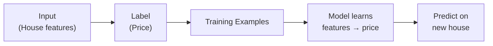
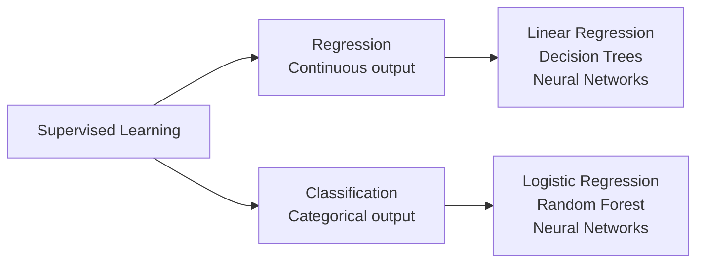
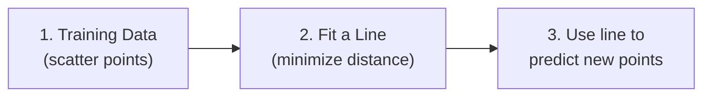
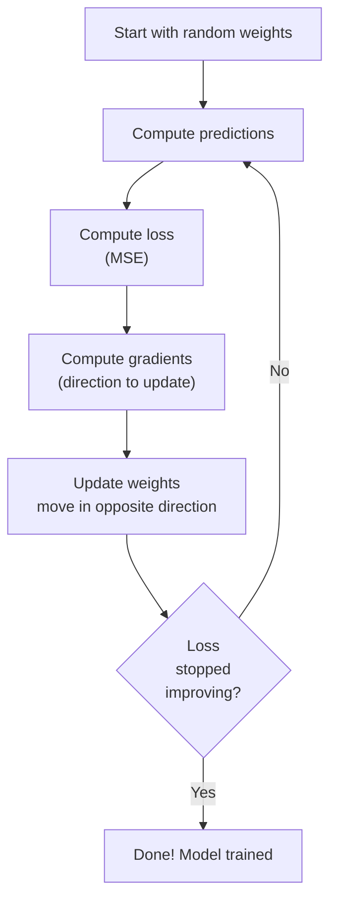
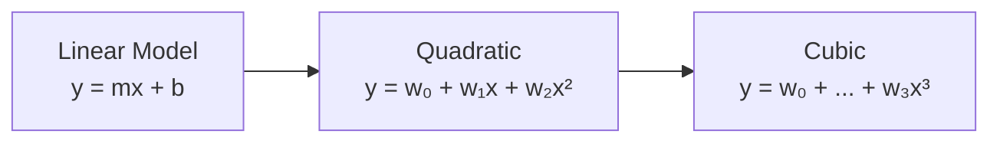
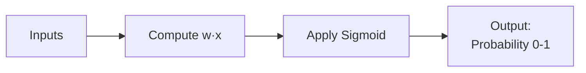
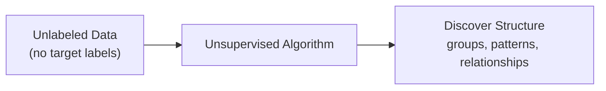
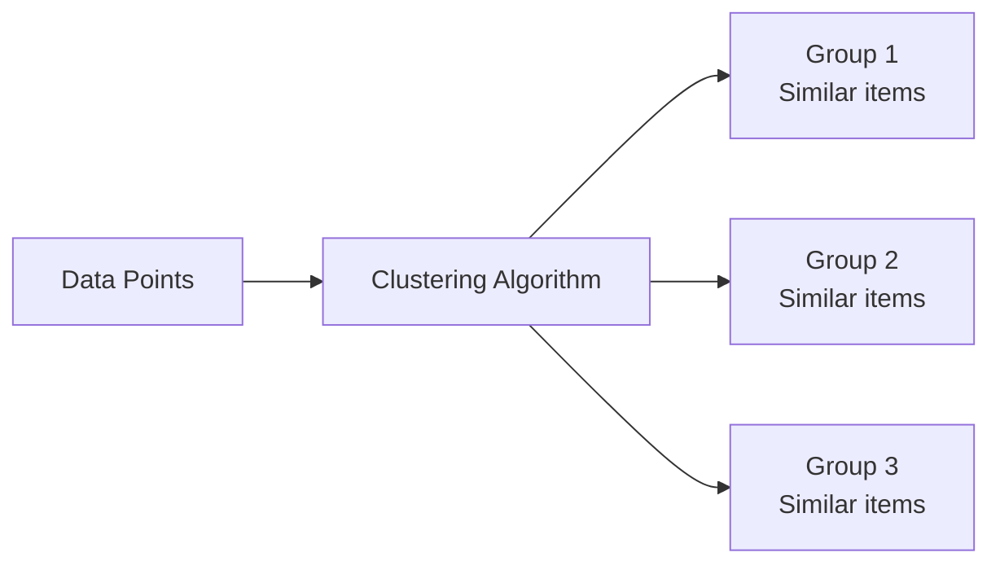
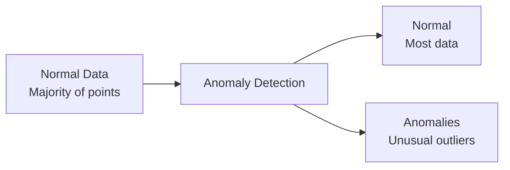
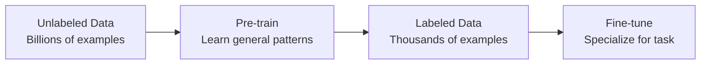

# 00.01 · Supervised vs Unsupervised Learning — Deep Dive { #supervised-unsupervised }

> **Level:** Beginner  
> **Pre-reading:** [00 · ML Fundamentals](00-ml-fundamentals.md)

---

## Supervised Learning: Learning from Labels

**Supervised Learning** means learning from **labeled examples**: you provide input-output pairs and the model learns to map inputs to outputs.



### Two Branches of Supervised Learning

#### 1. Regression — Predict Continuous Numbers

Predict a **continuous output value** (any number on a spectrum).

| Example | Input | Output | Use Case |
|:--------|:------|:-------|:---------|
| **House Price Prediction** | Square footage, bedrooms, location | Price ($) | Real estate |
| **Stock Price Forecasting** | Historical prices, volume, sentiment | Price tomorrow | Finance |
| **Temperature Forecasting** | Weather patterns, location | Temperature (°C) | Weather services |
| **Medical Risk Score** | Patient vitals, lab results | Risk (0–100) | Healthcare |

**Key characteristic:** Output is **continuous** — any value within a range.

#### 2. Classification — Predict Categories

Predict which **category** something belongs to.

| Example | Input | Output | Use Case |
|:--------|:------|:-------|:---------|
| **Email Spam Detection** | Email text, sender, subject | Spam / Not Spam | Email provider |
| **Image Classification** | Image pixels | Cat / Dog / Bird | Computer vision |
| **Disease Diagnosis** | Patient symptoms, tests | Healthy / Disease A / Disease B | Medicine |
| **Credit Approval** | Income, credit history, debt | Approve / Deny | Banking |
| **Sentiment Analysis** | Review text | Positive / Negative / Neutral | Business intelligence |

**Key characteristic:** Output is **categorical** — one of a fixed set of classes.



---

## Regression in Detail

### What Makes a Regression Problem?

A regression problem has these characteristics:

1. **Labeled training data** — each example has an input and a continuous output
2. **Continuous target** — output is a number that can be any value
3. **Goal** — learn a function that maps inputs to outputs

**Example: Predicting house prices**

```
Input Features:              Target:
Size: 2000 sqft      →      Price: $500,000
Bedrooms: 3          →
Age: 10 years        →
Location: Downtown   →
```

### Linear Regression — The Simplest Case

**Linear Regression** assumes a linear relationship: output is a weighted sum of inputs.

$$\hat{y} = w_0 + w_1 x_1 + w_2 x_2 + ... + w_n x_n$$

Or in matrix form: $\hat{y} = w \cdot x$

Where:
- $\hat{y}$ = predicted output
- $x_1, x_2, ..., x_n$ = input features
- $w_1, w_2, ..., w_n$ = weights (learned)
- $w_0$ = bias term (learned)

**Geometric intuition:** In 2D, it's fitting a line. In 3D, it's fitting a plane. In higher dimensions, it's fitting a hyperplane.



### How Linear Regression Learns

We minimize **Mean Squared Error (MSE)**:

$$L = \frac{1}{n} \sum_{i=1}^{n} (y_i - \hat{y}_i)^2$$

This measures the average squared difference between predicted and actual values.



### Polynomial Regression — Adding Complexity

What if the relationship isn't linear? Add polynomial terms:

$$\hat{y} = w_0 + w_1 x + w_2 x^2 + w_3 x^3 + ...$$

This can fit curves instead of straight lines.



---

## Classification in Detail

### What Makes a Classification Problem?

1. **Labeled training data** — each example has an input and a discrete category
2. **Discrete target** — output is one of a fixed set of classes
3. **Goal** — learn a function that assigns probabilities to each class

**Example: Email spam detection**

```
Input:                          Target:
Email text: "You've won!"  →   Category: SPAM
Sender: unknown@spam.com   →
Contains suspicious links  →
```

### Binary Classification — Two Classes

The simplest classification: predict one of two outcomes.

**Example problems:**
- Spam or Not Spam
- Fraudulent transaction or Legitimate
- Positive or Negative sentiment
- Disease present or Absent

#### Logistic Regression

Despite its name, **Logistic Regression** is for **classification**, not regression.

It outputs a **probability** between 0 and 1:

$$P(\text{class=1}) = \sigma(w \cdot x) = \frac{1}{1 + e^{-(w \cdot x)}}$$

Where $\sigma$ is the **sigmoid function**:



**Sigmoid function behavior:**
- Input very negative → Output ≈ 0 (class 0)
- Input near 0 → Output ≈ 0.5 (uncertain)
- Input very positive → Output ≈ 1 (class 1)

We then use a **threshold** (usually 0.5):
- If probability > 0.5 → predict class 1
- If probability ≤ 0.5 → predict class 0

**Loss function for binary classification:**

$$L = -\frac{1}{n} \sum_{i=1}^{n} [y_i \log(\hat{y}_i) + (1-y_i) \log(1-\hat{y}_i)]$$

This is **Binary Cross-Entropy Loss**. It penalizes wrong predictions severely.

### Multi-Class Classification — Many Classes

Predict one of **3 or more** classes.

**Example problems:**
- Digit recognition (0–9) — 10 classes
- Image classification (cat, dog, bird) — 3 classes
- Sentiment (negative, neutral, positive) — 3 classes

**Approach:** Extend logistic regression using **Softmax**:

$$P(\text{class}=k) = \frac{e^{w_k \cdot x}}{\sum_{j} e^{w_j \cdot x}}$$

This converts scores into a probability distribution that sums to 1.

**Loss function:**

$$L = -\frac{1}{n} \sum_{i=1}^{n} \sum_{k} y_{i,k} \log(\hat{y}_{i,k})$$

Where $y_{i,k} = 1$ if example $i$ is actually class $k$, else 0.

This is **Categorical Cross-Entropy Loss**.

---

## Unsupervised Learning: Learning Without Labels

**Unsupervised Learning** finds patterns in **unlabeled data** with no predefined outputs.



### Three Main Unsupervised Tasks

#### 1. Clustering — Group Similar Data

Group similar items together automatically.



| Algorithm | How It Works | Use Case |
|:----------|:------------|:---------|
| **K-Means** | Partition into K clusters by minimizing within-cluster distance | Customer segmentation, fast clustering |
| **Hierarchical** | Build a tree of clusters | Dendrograms, taxonomy creation |
| **DBSCAN** | Group points that are close together, find outliers | Anomaly detection, spatial clustering |
| **Gaussian Mixture Models** | Assume data comes from mixture of Gaussians | Soft clustering, probabilistic assignment |

**Example: Customer Segmentation**

```
Customer 1: Age 25, Income $40k, Purchases tech → Cluster 1
Customer 2: Age 26, Income $42k, Purchases tech → Cluster 1
Customer 3: Age 55, Income $120k, Purchases luxury → Cluster 2
Customer 4: Age 58, Income $130k, Purchases luxury → Cluster 2
```

The algorithm groups customers with similar profiles, enabling targeted marketing.

#### 2. Dimensionality Reduction — Compress Data

Reduce the number of features while preserving important information.

| Algorithm | What It Does | Use Case |
|:----------|:-----------|:---------|
| **Principal Component Analysis (PCA)** | Find directions of maximum variance, project onto them | Data compression, visualization, feature reduction |
| **t-SNE** | Preserve local structure, good for visualization | High-dim data visualization |
| **Autoencoders** | Learn compressed representation via neural network | Feature extraction, denoising |

**Example: Image Compression**

```
Original: 28×28 pixel image = 784 features
PCA reduces to: 20 dimensions
Retains 95% of information
Useful for visualization and faster training
```

#### 3. Anomaly Detection — Find Unusual Data

Detect data points that don't fit the normal pattern.



| Method | Approach | Use Case |
|:-------|:---------|:---------|
| **Isolation Forest** | Isolate anomalies using decision trees | Credit card fraud, network intrusion |
| **Local Outlier Factor (LOF)** | Detect points with much lower density than neighbors | Sensor data anomalies |
| **Autoencoders** | High reconstruction error = anomaly | Equipment failure prediction |
| **One-Class SVM** | Learn boundary around normal data | Quality control, rare event detection |

**Example: Fraud Detection**

```
Transaction 1: Amount $50, store nearby → Normal
Transaction 2: Amount $10,000, country away → ANOMALY
Transaction 3: Amount $75, store nearby → Normal
```

---

## Comparing Supervised vs Unsupervised

| Aspect | Supervised | Unsupervised |
|:-------|:-----------|:------------|
| **Data** | Labeled (input → output pairs) | Unlabeled |
| **Goal** | Predict output for new inputs | Find patterns, structure, relationships |
| **Effort** | Requires labeling (expensive) | No labeling needed (cheaper) |
| **Evaluation** | Easy — compare predictions to labels | Hard — no ground truth to compare to |
| **Use Cases** | Prediction, classification, forecasting | Exploration, compression, anomaly detection |
| **Confidence** | High — we know if predictions are right | Low — can't directly validate results |

### When to Use Each

**Use Supervised Learning when:**
- ✅ You have labeled data or can afford to label it
- ✅ You need to predict something specific
- ✅ You can evaluate performance easily
- ✅ Examples: price prediction, disease diagnosis, email filtering

**Use Unsupervised Learning when:**
- ✅ You have lots of data but no labels
- ✅ You want to explore structure in data
- ✅ You need to find anomalies
- ✅ You want to reduce data dimensionality
- ✅ Examples: customer segmentation, image compression, fraud detection

---

## Semi-Supervised Learning — The Middle Ground

Some techniques use **both labeled and unlabeled data**:

1. Pre-train on large unlabeled dataset (unsupervised)
2. Fine-tune on small labeled dataset (supervised)

This is called **self-supervised pre-training** and is how modern LLMs work!



---

## Self-Supervised Learning — Learning from Data Itself

**Self-supervised learning** creates labels automatically from the data structure.

**Examples:**
- **Next-token prediction** (LLMs): Mask a word, predict it from context
- **Image rotation prediction**: Rotate image, predict rotation angle
- **Contrastive learning**: Learn that augmented versions of same image are similar

This is how modern AI models (including LLMs) are pre-trained!

---

??? question "Why use unsupervised learning if supervised is more direct?"
    Supervised learning requires expensive labeling. Unsupervised lets you learn patterns from raw data. Also, unsupervised can discover surprising patterns humans didn't anticipate. Many real-world systems combine both.

??? question "How do I know if my clustering is good without labels?"
    Use metrics like **Silhouette Score** (how tightly grouped clusters are) or **Davies-Bouldin Index** (cluster separation). Or manually inspect clusters to see if they make intuitive sense.

??? question "Can I use unsupervised learning for prediction?"
    Not directly. Unsupervised finds patterns but doesn't predict a specific output. However, you can use unsupervised as a preprocessing step (e.g., cluster first, then use cluster membership as a feature for supervised learning).

---

--8<-- "_abbreviations.md"

