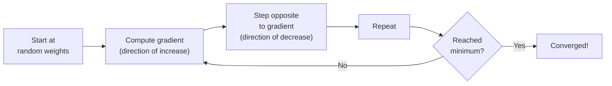
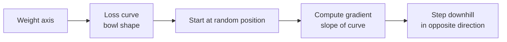
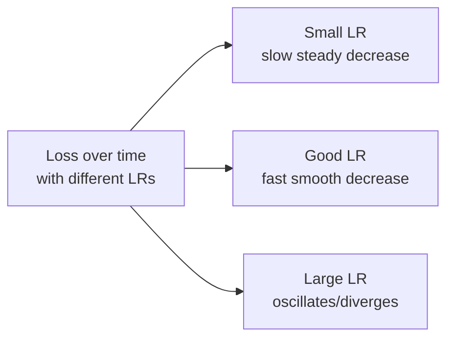
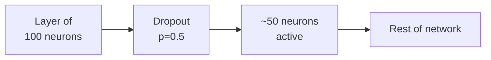
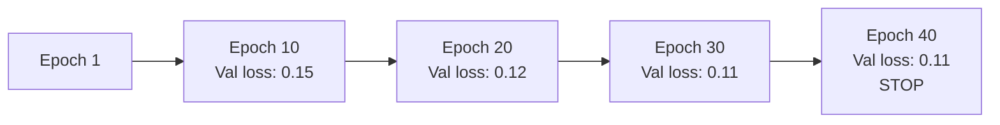

# 00.02 · Core ML Concepts — Deep Dive { #core-concepts }

> **Level:** Beginner  
> **Pre-reading:** [00 · ML Fundamentals](00-ml-fundamentals.md) · [00.01 · Supervised vs Unsupervised](00.01-supervised-unsupervised.md)

---

## Gradient Descent: How Models Learn

**Gradient Descent** is the algorithm that powers all modern machine learning. It's how we find weights that minimize loss.

### Intuitive Explanation

Imagine you're standing on a hill in thick fog and want to reach the valley. You can't see far, but you can **feel which direction is downhill** and take a step that way. Repeat this process and you'll eventually reach the bottom.



### Mathematical Formulation

The update rule for gradient descent:

$$w_{t+1} = w_t - \alpha \nabla L(w_t)$$

Where:
- $w_t$ = weights at iteration $t$
- $\alpha$ = learning rate (step size)
- $\nabla L(w_t)$ = gradient of loss with respect to weights

**Gradient** = partial derivatives showing how loss changes with each weight:

$$\nabla L = \begin{bmatrix} \frac{\partial L}{\partial w_1} \\ \frac{\partial L}{\partial w_2} \\ \vdots \\ \frac{\partial L}{\partial w_n} \end{bmatrix}$$

### Visualizing Gradient Descent

In 1D (single weight), loss is a curve. We start somewhere and slide downhill:



In 2D (two weights), loss is a landscape with valleys:

```
        ↓ Gradient points uphill
    *   * (step opposite direction)
   * ╲ * 
  *   V*  ← Direction of steepest descent
  *     *
   *   *  ← We step here
```

### Learning Rate: The Tricky Hyperparameter

The **learning rate** $\alpha$ controls step size. It's crucial:

| Learning Rate | Effect | Problem |
|:--------------|:-------|:--------|
| **Too small** | Tiny steps, converges very slowly | Takes forever to train |
| **Just right** | Steady progress to minimum | ✅ Ideal |
| **Too large** | Huge steps, can overshoot minimum | Oscillates or diverges (loss increases!) |



**Practical rule:** Start with a small learning rate (0.001) and increase until loss starts oscillating. Then use a rate slightly smaller.

### Batch Size

Do we update weights after seeing:
- 1 example? (**batch size = 1**)
- 32 examples? (**batch size = 32**)
- All 10,000 examples? (**batch size = 10,000**)

**Effects:**

| Batch Size | Gradient Estimate | Stability | Speed | Memory |
|:-----------|:-----------------|:----------|:------|:-------|
| **Small (1–32)** | Noisy (high variance) | Less stable, more oscillation | Fast | Low |
| **Medium (32–256)** | Balanced | Good stability | Balanced | Balanced |
| **Large (1000+)** | Smooth (low variance) | Very stable | May be slow | High |

**Intuition:** Small batches give noisier gradient estimates but update more frequently. Large batches give cleaner estimates but update less frequently.

### Variants of Gradient Descent

#### Batch Gradient Descent
Use entire dataset for each update:

$$w_{t+1} = w_t - \alpha \sum_{i=1}^{n} \nabla L(x_i, y_i, w_t)$$

- ✅ Smooth convergence
- ❌ Slow for large datasets
- ❌ Uses lots of memory

#### Stochastic Gradient Descent (SGD)
Update after each single example:

$$w_{t+1} = w_t - \alpha \nabla L(x_i, y_i, w_t)$$

- ✅ Fast, frequent updates
- ❌ Noisy, can oscillate
- ❌ Hard to parallelize

#### Mini-Batch Gradient Descent
Update after each small batch (most common):

$$w_{t+1} = w_t - \alpha \frac{1}{B} \sum_{i=1}^{B} \nabla L(x_i, y_i, w_t)$$

- ✅ Balanced — stable and fast
- ✅ Parallelizable
- ✅ Most practical approach

---

## Optimization Algorithms: Beyond Basic Gradient Descent

Basic gradient descent can be slow. Modern algorithms add **momentum** and **adaptive learning rates**.

### Momentum

Remember the direction you were moving and build momentum:

$$v_t = \beta v_{t-1} + \nabla L(w_t)$$
$$w_{t+1} = w_t - \alpha v_t$$

**Intuition:** Like a ball rolling down a hill — it gains speed in the downhill direction, helping it escape shallow local minima.

### Adam (Adaptive Moment Estimation)

Combines momentum with **adaptive learning rates** per parameter:

$$m_t = \beta_1 m_{t-1} + (1-\beta_1) \nabla L$$
$$v_t = \beta_2 v_{t-1} + (1-\beta_2) (\nabla L)^2$$
$$w_{t+1} = w_t - \alpha \frac{m_t}{\sqrt{v_t} + \epsilon}$$

**Intuition:**
- $m_t$ = exponential average of gradients (momentum)
- $v_t$ = exponential average of squared gradients (learning rate per parameter)
- Parameters with large gradients get smaller updates; parameters with small gradients get larger updates

**Why Adam is popular:**
- ✅ Works well with mini-batches
- ✅ Handles sparse gradients
- ✅ Adaptive learning rates eliminate manual tuning
- ✅ Converges faster than vanilla SGD

---

## Regularization: Preventing Overfitting

Overfitting is when a model memorizes training data instead of learning general patterns. Regularization adds constraints to prevent this.

### L1 Regularization (Lasso)

Add penalty proportional to absolute values of weights:

$$L_{total} = L_{original} + \lambda \sum_{i} |w_i|$$

**Effect:**
- Encourages weights toward zero
- Some weights become exactly zero (feature selection)
- Results in **sparse models**

### L2 Regularization (Ridge)

Add penalty proportional to squared values of weights:

$$L_{total} = L_{original} + \lambda \sum_{i} w_i^2$$

**Effect:**
- Discourages large weights
- Spreads influence across features
- Smoother, more stable models

### L1 vs L2

| Aspect | L1 | L2 |
|:-------|:---|:---|
| **Penalty** | Sum of absolute values | Sum of squares |
| **Effect** | Sparse (some weights = 0) | Dense (all weights small) |
| **Use when** | Want feature selection | Want general regularization |
| **Outliers** | More robust | Influenced by outliers |

**Elastic Net** = combination of L1 + L2, gets best of both.

### Dropout

During training, randomly **deactivate neurons** with probability $p$:



**Why it works:**
- Prevents neurons from co-adapting (relying too much on each other)
- Forces network to learn redundant representations
- Acts like training many models and averaging them

**During inference:** Use all neurons but scale by $(1-p)$ to account for dropout.

### Early Stopping

Monitor validation loss during training. Stop when it stops improving:



**Why:**
- Training loss always decreases (model memorizes)
- Validation loss eventually increases (overfitting)
- Stop at the minimum validation loss

---

## Batch Normalization

Normalize inputs to each layer to have mean 0 and standard deviation 1:

$$\hat{x} = \frac{x - \text{mean}(x)}{\sqrt{\text{var}(x) + \epsilon}}$$

**Benefits:**
- ✅ Stabilizes training (can use higher learning rates)
- ✅ Reduces internal covariate shift
- ✅ Acts as mild regularizer
- ✅ Can sometimes eliminate need for dropout

**When to use:** Almost always in deep networks. It's become standard practice.

---

## Hyperparameters vs Parameters

| | Parameters | Hyperparameters |
|:--|:-----------|:----------------|
| **Definition** | Values learned during training | Values set before training |
| **Examples** | Weights, biases | Learning rate, batch size, dropout rate |
| **Tuned how** | Via gradient descent | Via experimentation or grid search |
| **Changed during** | Every training iteration | Only between training runs |

**Hyperparameter tuning** is the art of choosing values that lead to good generalization.

### Common Hyperparameters

| Hyperparameter | Role | Typical Range |
|:---------------|:-----|:--------------|
| **Learning rate** | Step size for weight updates | 0.0001–0.1 |
| **Batch size** | Examples per gradient update | 16–512 |
| **Epochs** | Passes through dataset | 10–1000 |
| **Dropout rate** | Probability of deactivating neurons | 0.2–0.5 |
| **L2 lambda** | Regularization strength | 0.0001–0.01 |
| **Hidden layer size** | Number of neurons per layer | 32–1024 |
| **Number of layers** | Depth of network | 2–50 |

**Strategy for tuning:**
1. Start with default values from literature
2. Do quick coarse grid search (10x ranges)
3. Zoom in on good region
4. Fine-tune specific hyperparameters

---

## Validation Metrics in Detail

### Precision, Recall, and F1 for Classification

**Confusion Matrix:**

|  | Predicted Positive | Predicted Negative |
|:--|:--:|:--:|
| **Actually Positive** | TP (True Positive) | FN (False Negative) |
| **Actually Negative** | FP (False Positive) | TN (True Negative) |

**Metrics:**

$$\text{Accuracy} = \frac{TP + TN}{TP + TN + FP + FN}$$

$$\text{Precision} = \frac{TP}{TP + FP} \quad \text{(of predicted positives, how many were right?)}$$

$$\text{Recall} = \frac{TP}{TP + FN} \quad \text{(of actual positives, how many did we find?)}$$

$$\text{F1} = 2 \cdot \frac{\text{Precision} \times \text{Recall}}{\text{Precision} + \text{Recall}}$$

**When to use each:**
- **Accuracy:** When classes are balanced and cost of false positives = cost of false negatives
- **Precision:** When false positives are costly (email spam → wrong predictions annoying users)
- **Recall:** When false negatives are costly (disease diagnosis → missing a disease is dangerous)
- **F1:** When you want to balance both and classes are imbalanced

### ROC-AUC for Ranking Models

Plot TPR vs FPR at different classification thresholds:

$$\text{TPR} = \frac{TP}{TP + FN}$$
$$\text{FPR} = \frac{FP}{FP + TN}$$

**AUC** = area under the ROC curve, measures how well model ranks positives above negatives.

---

## Evaluation on Imbalanced Data

When one class dominates (e.g., 99% negative, 1% positive):

**Don't use accuracy** — a model predicting everything as negative would get 99% accuracy!

**Instead use:**
- **Precision-Recall curve** — shows trade-off
- **F1 score** — harmonic mean
- **AUC-ROC** — threshold-independent

**Or use:** Class weights or oversampling/undersampling techniques.

---

??? question "What's the relationship between learning rate and batch size?"
    Smaller batches need smaller learning rates (noisier gradients). Larger batches can use larger learning rates (smoother gradients). There's a trade-off: smaller batches update more frequently (good) but noisily (bad).

??? question "Should I always use L2 regularization?"
    Usually yes, but it depends. If you're overfitting, add regularization. If you're underfitting (training loss is already high), don't — you have too few parameters, not too many.

??? question "How do I choose between dropout and batch normalization?"
    You can use both! Batch norm is almost always useful in deep networks. Dropout is helpful in very deep networks or when you have limited data. Batch norm often makes dropout less necessary.

---

--8<-- "_abbreviations.md"

