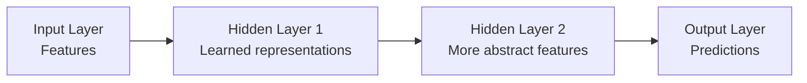
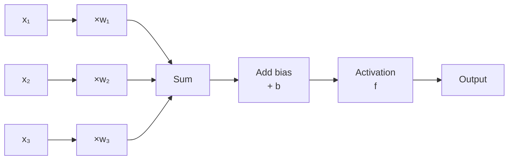
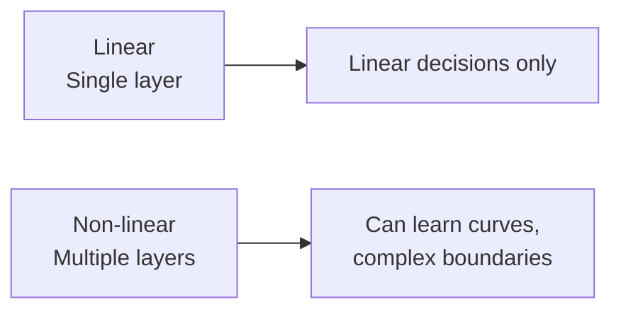

# 01 · Neural Network Basics { #neural-networks }

> **Level:** Beginner to Intermediate  
> **Pre-reading:** [00 · ML Fundamentals](00-ml-fundamentals.md) · [00.02 · Core Concepts](00.02-core-concepts.md)

---

## What is a Neural Network?

A **neural network** is a computational model inspired by biological brains. It consists of interconnected **neurons** arranged in **layers**, where each neuron applies a simple transformation and passes the result to the next layer.

---

## The Biological Inspiration

A biological neuron:
- Receives signals from other neurons (dendrites)
- Processes them in the cell body
- Sends output to other neurons (axon)

An artificial neuron:
- Receives inputs (features)
- Weighs them and combines them
- Applies an activation function
- Sends output to next layer

---

## Artificial Neuron: The Basic Unit

A single artificial neuron computes:

$$\text{output} = f(w_1 x_1 + w_2 x_2 + ... + w_n x_n + b)$$

Where:
- $x_1, x_2, ..., x_n$ = inputs
- $w_1, w_2, ..., w_n$ = weights (learned)
- $b$ = bias (learned)
- $f$ = activation function

---

## Activation Functions

Activation functions introduce **non-linearity**, enabling networks to learn complex patterns.

### ReLU (Rectified Linear Unit)

$$f(x) = \max(0, x)$$

- **Output:** 0 if input < 0, otherwise input
- **Range:** [0, ∞)
- **When:** Hidden layers (most common modern choice)
- **Advantages:** Simple, fast, works well in practice
- **Problem:** "Dying ReLU" — some neurons always output 0

### Sigmoid

$$f(x) = \frac{1}{1 + e^{-x}}$$

- **Output:** Between 0 and 1
- **Range:** (0, 1)
- **When:** Binary classification output layer
- **Advantages:** Output is probability
- **Problem:** Gradients vanish at extremes (slow training)

### Tanh (Hyperbolic Tangent)

$$f(x) = \frac{e^x - e^{-x}}{e^x + e^{-x}}$$

- **Output:** Between -1 and 1
- **Range:** (-1, 1)
- **When:** Hidden layers (smoother than sigmoid)
- **Advantages:** Centered at 0, stronger gradients than sigmoid
- **Problem:** Still suffers from vanishing gradients

### Softmax

$$f(x_i) = \frac{e^{x_i}}{\sum_j e^{x_j}}$$

- **Output:** Probability distribution (sums to 1)
- **Range:** Valid probability
- **When:** Multi-class classification output layer
- **Advantages:** Outputs sum to 1, interpretable as probabilities

---

## Layers and Networks

### Fully Connected Layer

Every neuron in layer $l$ connects to every neuron in layer $l+1$.

If layer has:
- Input: 100 features
- 50 neurons

Then: 100 × 50 = 5,000 weights + 50 biases = 5,050 parameters

### Network Depth and Width

| Term | Meaning | Effect |
|:-----|:--------|:-------|
| **Shallow Network** | Few hidden layers (1–2) | Can learn simple patterns |
| **Deep Network** | Many hidden layers (10+) | Can learn hierarchical, complex patterns |
| **Narrow Network** | Few neurons per layer | Fewer parameters, faster, but may underfit |
| **Wide Network** | Many neurons per layer | More parameters, slower, but more expressive |

---

## Why Networks Need Depth

A single-layer network (linear transformation) can only learn linear patterns.

Two or more layers can learn **any** continuous function (universal approximation theorem).

---

### Interview Q&A

??? question "What does a neuron actually compute?"
    A neuron computes a weighted sum of its inputs, adds a bias, and passes the result through a non-linear activation function. Mathematically: $f(w \cdot x + b)$.

??? question "Why do we need activation functions?"
    Without activation functions, stacking layers would just compose linear transformations, which is still linear. Activation functions introduce non-linearity, allowing networks to learn complex patterns.

??? question "How many hidden layers do I need?"
    Start with 1–2 hidden layers. Add more if training loss is high (underfitting). Use regularization if validation loss is high (overfitting). Deep networks are powerful but slow and need more data.

---

--8<-- "_abbreviations.md"

