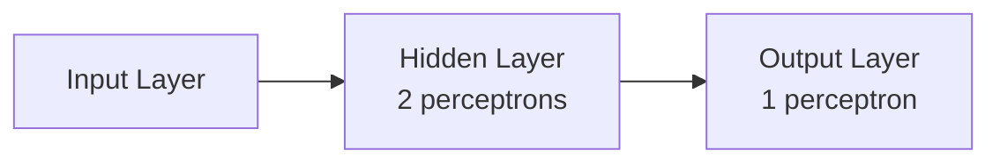

# 01.01 · Perceptrons & Activation Functions — Deep Dive { #perceptrons }

> **Level:** Intermediate  
> **Pre-reading:** [01 · Neural Networks](01-neural-networks.md)

---

## The Perceptron: Foundation of Neural Networks

The **Perceptron** is the simplest neural network — a single neuron that classifies linearly separable data.

A perceptron computes:

$$\text{output} = \begin{cases} 1 & \text{if } w \cdot x + b > 0 \\ 0 & \text{otherwise} \end{cases}$$

This draws a linear decision boundary in the input space.

---

## Perceptron Learning Algorithm

Iterate over training examples:

1. Make a prediction
2. If wrong, adjust weights in direction of correct answer
3. Repeat until all examples are correct

$$w_{t+1} = w_t + y_i (x_i - \hat{y}_i)$$

This converges if data is linearly separable.

---

## The XOR Problem

The perceptron can learn linearly separable patterns but **fails on XOR** (not linearly separable).

Solution: Use **multiple layers** with activation functions.

This is why we need deep networks!

---

## Activation Functions: Detailed Comparison

| Function | Formula | Range | Derivative | When to Use |
|:---------|:--------|:------|:-----------|:-----------|
| ReLU | max(0, x) | [0, ∞) | 0 or 1 | Hidden layers |
| Sigmoid | 1/(1+e^-x) | (0,1) | σ(x)(1-σ(x)) | Binary output |
| Tanh | (e^x-e^-x)/(e^x+e^-x) | (-1,1) | 1-tanh²(x) | Hidden layers |
| Softmax | e^xi/∑e^xj | Valid prob | Complex | Multi-class output |
| Leaky ReLU | max(αx, x) | (-∞, ∞) | α or 1 | Fix dying ReLU |

---

??? question "What's the difference between ReLU and Leaky ReLU?"
    ReLU outputs 0 for negative inputs, which can cause neurons to die (always output 0). Leaky ReLU outputs a small negative value (α×x) instead, allowing gradients to flow even for negative inputs.

??? question "Why is sigmoid not used in hidden layers anymore?"
    Sigmoids suffer from vanishing gradients — at extremes, the derivative is nearly 0, so gradients don't flow through training. ReLU has constant gradient for positive inputs, enabling better training of deep networks.

??? question "Can I use ReLU in the output layer?"
    Only if your output is non-negative (e.g., image pixels, prices). For binary classification, use sigmoid. For multi-class, use softmax. For regression with any range, consider linear (no activation).

---

--8<-- "_abbreviations.md"

