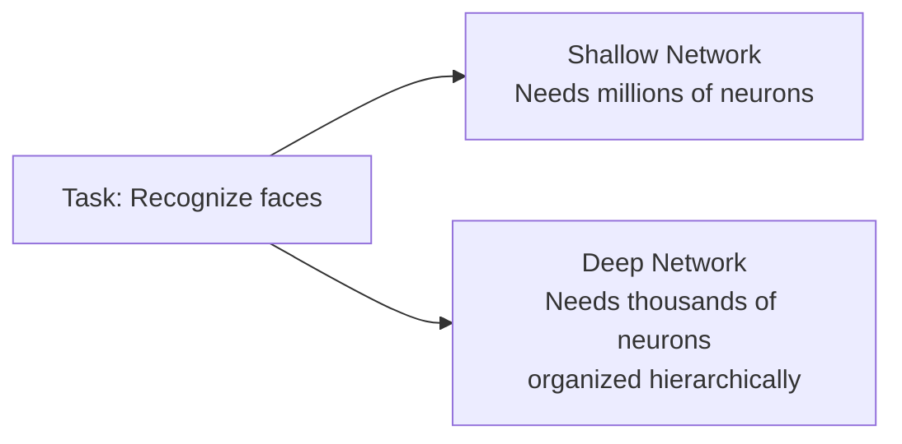

# 02 · Deep Learning Overview { #deep-learning }

> **Level:** Intermediate  
> **Pre-reading:** [01 · Neural Networks](01-neural-networks.md) · [01.02 · Backpropagation](01.02-backpropagation.md)

---

## What Makes Deep Learning "Deep"?

**Deep Learning** uses neural networks with **many layers** (typically 3+, often 10–100+). The term "deep" refers to the depth of the network.

Deep networks learn **hierarchical representations**:
- Lower layers learn low-level features (edges, textures)
- Middle layers combine them into mid-level features (shapes, patterns)
- Top layers learn high-level concepts (objects, meanings)

This hierarchical learning is why deep networks are so powerful.

---

## Why Depth Works

A single hidden layer can theoretically learn any function (universal approximation). But:

- **Shallow networks need exponentially many neurons** for complex functions
- **Deep networks learn efficiently** by building hierarchies

---

## Deep Learning Architectures

Different architectures for different data types:

| Architecture | Input Type | Key Idea |
|:------------|:-----------|:---------|
| **CNN** | Images | Convolutions detect local patterns |
| **RNN** | Sequences | Recurrence maintains hidden state |
| **Transformer** | Sequences | Self-attention (no recurrence) |
| **GNN** | Graphs | Message passing on graph structure |
| **Autoencoder** | Any | Encoder + decoder for compression |

---

## Training Deep Networks

Deep networks are harder to train than shallow ones:

**Challenges:**
- Vanishing gradients (gradients shrink exponentially through layers)
- Exploding gradients (gradients grow exponentially)
- More parameters to learn (need more data)

**Solutions:**
- ReLU activations (avoid vanishing gradients)
- Batch normalization (stabilize training)
- Skip connections / residual networks (propagate gradients)
- Dropout (prevent overfitting)

---

??? question "How deep should my network be?"
    Start with 3–4 layers. Add more if training loss is high. Use regularization if validation loss is high. Very deep networks (50+) need careful tuning.

??? question "Why do deep networks generalize well despite having more parameters?"
    Because they learn hierarchical structure. Lower layers share representations across the network, reducing effective parameters. Also, regularization (dropout, batch norm, L2) prevents overfitting.

---

--8<-- "_abbreviations.md"

