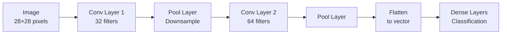

# 02.01 · Convolutional Neural Networks { #cnn }

> **Level:** Intermediate  
> **Pre-reading:** [02 · Deep Learning Overview](02-deep-learning-overview.md)

---

## What is a CNN?

A **Convolutional Neural Network (CNN)** is designed for spatial data like images. Instead of fully connecting every neuron, CNNs use **convolutions** — sliding filters that detect local patterns.



---

## Convolution Operation

A **convolution** slides a learnable **filter** (kernel) over the input and computes element-wise products and sums.

Filter detects patterns like:
- Horizontal edges
- Vertical edges
- Corners
- Textures
- Shapes

```
Input:        Filter:       Output:
1 2 3         1 0 -1        (1+2-3)+... = result
4 5 6         2 0 -2
7 8 9         1 0 -1
```

---

## Key CNN Components

| Component | Role |
|:----------|:-----|
| **Convolution** | Apply filters, detect patterns |
| **Pooling** | Downsample, reduce spatial dimensions |
| **Activation** | ReLU, add non-linearity |
| **Flatten** | Convert 2D feature maps to 1D |
| **Dense** | Fully connected layers for classification |

---

## Why CNNs Work for Images

- **Local connectivity:** Neurons only connect to local patches (more efficient than fully connected)
- **Weight sharing:** Same filter applied everywhere (fewer parameters)
- **Hierarchy:** Early layers detect edges, later layers detect shapes, top layers detect objects

---

??? question "What's the difference between convolution and correlation?"
    Technically, convolution flips the filter, correlation doesn't. In deep learning, we call it convolution but actually do correlation. It doesn't matter — both work fine.

??? question "Why use pooling?"
    Pooling downsamples the feature maps, reducing parameters and computation. It also makes features more robust to small shifts.

---

--8<-- "_abbreviations.md"

