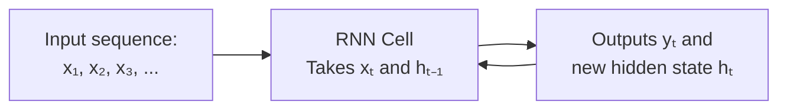

# 02.02 · Recurrent Neural Networks { #rnn }

> **Level:** Intermediate  
> **Pre-reading:** [02 · Deep Learning Overview](02-deep-learning-overview.md)

---

## What is an RNN?

A **Recurrent Neural Network (RNN)** processes **sequences** by maintaining a **hidden state** that gets updated at each time step.

Unlike CNNs (for images) and fully-connected networks, RNNs have **loops** — they pass information from one step to the next.

---

## Recurrence in Action

At each time step:

$$h_t = \tanh(w_h h_{t-1} + w_x x_t + b)$$
$$y_t = w_o h_t + b_o$$

Where:
- $h_{t-1}$ = hidden state from previous step
- $x_t$ = input at current step
- $h_t$ = hidden state at current step
- $y_t$ = output at current step

The hidden state acts as **memory** — it carries information forward through time.

---

## LSTM: Better Recurrence

Vanilla RNNs suffer from vanishing gradients. **LSTMs (Long Short-Term Memory)** use **gates** to control information flow:

- **Forget gate:** Decide what to discard
- **Input gate:** Decide what to add
- **Output gate:** Decide what to output

LSTMs can learn long-term dependencies better than vanilla RNNs.

---

## GRU: Simplified LSTM

**GRU (Gated Recurrent Unit)** is simpler than LSTM but similarly effective. It has two gates instead of three.

---

## When to Use RNNs

RNNs excel at:
- Machine translation
- Speech recognition
- Language modeling
- Time-series prediction
- Any sequential data

For modern applications, **Transformers** have largely replaced RNNs because they're parallelizable and can handle longer sequences.

---

??? question "Why do RNNs suffer from vanishing gradients?"
    Gradients are multiplied by the recurrent weight matrix at each step. If this weight < 1, gradients shrink exponentially. LSTMs use gates and skip connections to allow gradients to flow.

??? question "Can RNNs be bidirectional?"
    Yes! Process sequence forward and backward, concatenate hidden states. Useful when you have access to future context (e.g., machine translation with source sentence).

---

--8<-- "_abbreviations.md"

