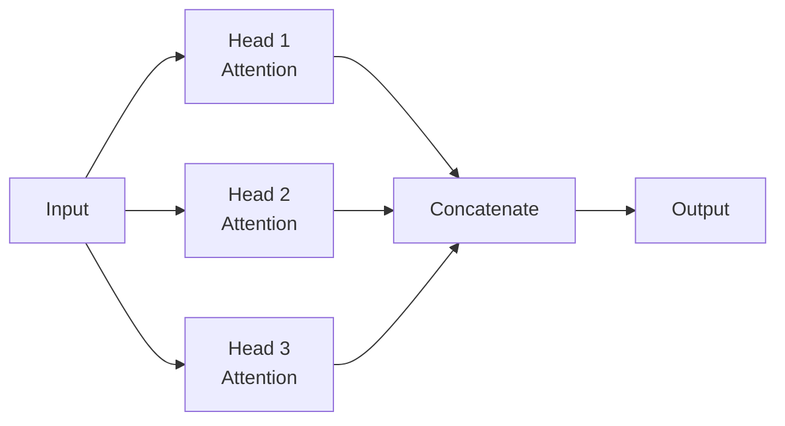

# 02.03 · Transformer Architecture { #transformer }

> **Level:** Intermediate to Advanced  
> **Pre-reading:** [02 · Deep Learning Overview](02-deep-learning-overview.md) · [02.02 · Recurrent Neural Networks](02.02-rnn.md)

---

## The Transformer Revolution

**Transformers** (2017) replaced RNNs with **self-attention**, revolutionizing deep learning. All modern LLMs are based on Transformers.

Key advantages:
- **Parallelizable:** Process entire sequence at once (RNNs must process sequentially)
- **Long-range dependencies:** Attention can reach any token (RNNs gradient vanishing limits range)
- **Transfer learning:** Pre-train on huge datasets, fine-tune for tasks

---

## Self-Attention: The Core Innovation

Self-attention allows each token to **attend to** (look at) every other token in the sequence.

For each token, compute:

1. **Query (Q):** "What am I looking for?"
2. **Key (K):** "What am I?" (from all tokens)
3. **Value (V):** "What information do I have?" (from all tokens)

Then:

$$\text{Attention}(Q, K, V) = \text{softmax}\left(\frac{QK^T}{\sqrt{d_k}}\right) V$$

This computes a weighted average of values, where weights are determined by query-key similarity.

---

## Multi-Head Attention

Instead of single attention, use **multiple heads** in parallel:

Each head learns different types of relationships between tokens.

---

## Transformer Block

A Transformer block contains:

1. **Multi-head self-attention**
2. **Feed-forward network** (two dense layers with ReLU)
3. **Residual connections** (skip connections)
4. **Layer normalization**

These are stacked many times (12–96 layers in large models).

---

## Positional Encoding

Transformers process all tokens in parallel, so they need explicit **position information**.

Add positional encodings to input embeddings:

$$PE(pos, 2i) = \sin(pos / 10000^{2i/d})$$
$$PE(pos, 2i+1) = \cos(pos / 10000^{2i/d})$$

This encodes position information that attention can use.

---

## Why Transformers Work

- **Attention mechanism** learns which tokens are relevant to each other
- **Parallel processing** enables training on massive datasets
- **Long-range dependencies** captured effectively
- **Transfer learning** — pre-train on huge corpus, fine-tune for tasks

This is exactly what LLMs leverage!

---

??? question "Why divide by √dk in attention?"
    Prevents softmax from saturating (gradients too small). Keeps attention weights distributed.

??? question "What's the difference between self-attention and cross-attention?"
    Self-attention: tokens attend to each other within a sequence. Cross-attention: tokens from one sequence attend to tokens from another sequence (used in encoder-decoder models).

??? question "How many layers do modern LLMs have?"
    GPT-4 and Claude use 96+ layers. Typical range: 12–96 layers depending on model size.

---

--8<-- "_abbreviations.md"

