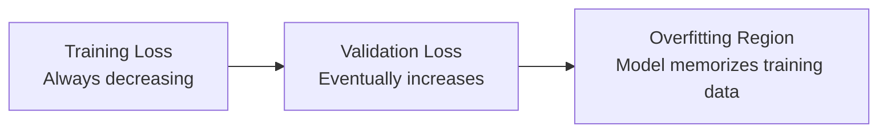

# 03.01 · Regularization & Generalization { #regularization }

> **Level:** Intermediate  
> **Pre-reading:** [00.02 · Core Concepts](00.02-core-concepts.md) · [03 · Optimization & Training](03-optimization-training.md)

---

## The Generalization Problem

The fundamental goal is **generalization** — model performs well on unseen data, not just training data.



---

## Regularization Techniques

### Data Augmentation

Create variations of training data:

- **For images:** Rotation, flip, crop, color jitter
- **For text:** Synonym replacement, word dropout
- **For time series:** Jittering, scaling, shifting

Benefits:
- ✅ Larger effective training set
- ✅ Model learns robustness
- ✅ Works without modifying architecture

---

### Architecture-Based Regularization

#### Dropout

Randomly deactivate neurons during training (typical dropout rate: 0.3–0.5):

$$y = \begin{cases} \frac{x}{1-p} & \text{with probability } 1-p \\ 0 & \text{with probability } p \end{cases}$$

Why it works:
- Prevents co-adaptation
- Ensemble effect
- Acts as model averaging

#### Batch Normalization

Normalize layer inputs:

$$\hat{x} = \frac{x - \mu_B}{\sqrt{\sigma_B^2 + \epsilon}}$$

Then scale and shift:

$$y = \gamma \hat{x} + \beta$$

Benefits:
- Stabilizes training
- Allows higher learning rates
- Acts as regularizer
- Can sometimes replace dropout

---

### Weight Penalty Methods

#### L2 Regularization (Ridge)

Add penalty to loss:

$$L_{total} = L_{data} + \lambda \sum_i w_i^2$$

Effect: Discourages large weights, distributed influence.

#### L1 Regularization (Lasso)

$$L_{total} = L_{data} + \lambda \sum_i |w_i|$$

Effect: Encourages sparsity, some weights exactly zero.

#### Elastic Net

Combine L1 + L2:

$$L_{total} = L_{data} + \lambda_1 \sum_i |w_i| + \lambda_2 \sum_i w_i^2$$

---

### Training-Based Regularization

#### Early Stopping

Monitor validation loss, stop when it stops improving:

```
Epoch 1-10:   Validation loss decreases ✓
Epoch 11-20:  Validation loss increases ✗ → STOP HERE
```

Simple and effective.

#### Learning Rate Decay

Reduce learning rate over time — prevents overfitting in later training stages.

---

## Choosing Regularization Strategy

| Problem | Solution |
|:--------|:---------|
| **High training loss, high validation loss** | Underfitting — add model capacity, reduce regularization |
| **Low training loss, high validation loss** | Overfitting — add regularization, more data |
| **Both low** | ✅ Success! |

---

??? question "Should I use both dropout and batch norm?"
    Usually, yes. Batch norm often makes dropout less necessary, but they're complementary. Batch norm stabilizes training; dropout prevents overfitting.

??? question "How do I choose regularization strength?"
    Use validation loss as guide. Try values from 0.0001 to 0.1. Pick value where validation loss is lowest.

---

--8<-- "_abbreviations.md"

