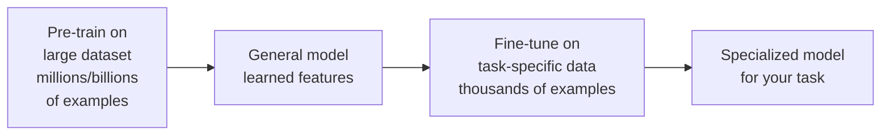
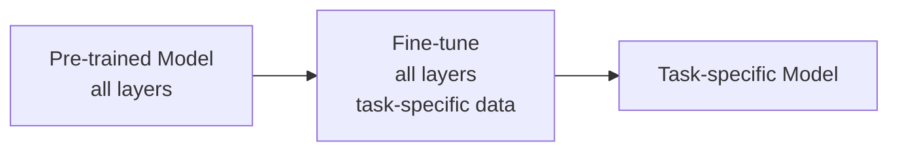
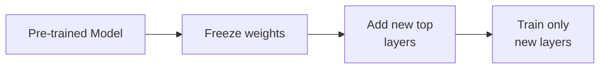

# 03.02 · Transfer Learning & Pre-training { #transfer-learning }

> **Level:** Intermediate to Advanced  
> **Pre-reading:** [02 · Deep Learning Overview](02-deep-learning-overview.md) · [03 · Optimization & Training](03-optimization-training.md)

---

## The Power of Transfer Learning

**Transfer learning** uses knowledge from one task to solve another task faster and with less data.

---

## Why Transfer Learning Works

**Neural networks learn hierarchical features:**
- **Lower layers:** General features (edges, textures, shapes)
- **Middle layers:** Medium-level features (objects, patterns)
- **Top layers:** Task-specific features

Features learned on one task often generalize to other tasks because the underlying patterns are similar.

---

## Pre-training Strategies

### Supervised Pre-training

Train on large labeled dataset:
- ImageNet for vision (14M images, 1000 classes)
- Wiki + Books for language (text corpus)

### Self-Supervised Pre-training (Modern Approach)

Create labels automatically from data:

**For images:**
- Masked image modeling (mask patches, predict them)
- Contrastive learning (learn that augmented images are similar)

**For text:**
- **Masked language modeling:** Mask words, predict them from context
- **Next-token prediction:** Predict next word from previous words (how LLMs work!)

This is how modern LLMs are pre-trained on billions of tokens!

---

## Fine-tuning Strategies

### Full Fine-tuning

Train all layers on task-specific data:

Pros: Most flexible, best performance
Cons: Need more data, more computation

### Feature Extraction

Freeze pre-trained layers, only train top layers:

Pros: Fast, needs little data
Cons: Less flexible, may not adapt well

### LoRA (Low-Rank Adaptation)

Add small trainable matrices alongside frozen weights:

$$W_{new} = W_{pretrained} + \alpha B A^T$$

Where $A, B$ are small learnable matrices (reduces parameters).

---

## Domain Adaptation

Transfer learning to different but related domains:

**Example:** Model trained on natural images (ImageNet) transfers well to medical images, even though they look different.

**Key insight:** Generic features (edges, textures) learned on ImageNet help with medical images.

---

## When to Use Transfer Learning

| Scenario | Use Transfer Learning |
|:---------|:------|
| Large dataset, unlimited compute | ✓ Maybe (can train from scratch, but transfer learning is faster) |
| Limited labeled data | ✓ Yes (transfer learning is essential) |
| Similar domain to pre-training | ✓ Yes (features transfer well) |
| Very different domain | ✓ Probably (features may still help) |
| Extremely specialized domain | ? Maybe (depends on data size) |

---

??? question "How much fine-tuning data do I need?"
    Rule of thumb: 1,000–10,000 examples. Transfer learning drastically reduces data requirements compared to training from scratch.

??? question "Should I use a lower learning rate when fine-tuning?"
    Yes! Use 1–10× smaller learning rate than for training from scratch. Pre-trained weights are already good; you want small adjustments.

??? question "Can I combine models trained with transfer learning?"
    Yes, with ensemble methods. Or use multi-task learning to train on multiple tasks simultaneously.

---

--8<-- "_abbreviations.md"

