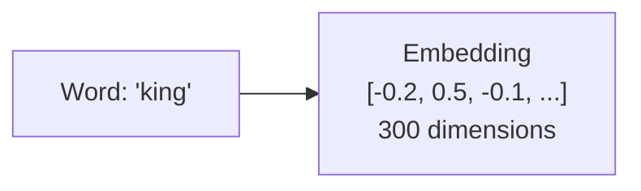

# 04 · Word Embeddings { #embeddings }

> **Level:** Intermediate  
> **Pre-reading:** [03.02 · Transfer Learning](03.02-transfer-learning.md)

---

## What is an Embedding?

An **embedding** is a **dense numerical vector** representing the semantic meaning of text or data.



**Key insight:** Similar meaning → similar vectors.

---

## Why Embeddings Matter

Embeddings capture **semantic relationships**:

- "king" - "man" + "woman" ≈ "queen" (famous example!)
- Words with similar meanings have similar vectors
- Enables semantic search, similarity, clustering

Without embeddings:
- Can't easily compare words
- Can't find semantic similarity
- No way to measure "distance" in meaning

---

## Vector Similarity

How do we know two embeddings are similar?

$$\text{cosine similarity} = \frac{u \cdot v}{|u| |v|} \quad \text{(ranges -1 to 1)}$$

- 1 = identical direction (very similar)
- 0 = orthogonal (unrelated)
- -1 = opposite direction (opposite meaning)

---

## Word2Vec

One of the first popular embedding methods. Two variants:

### Skip-gram

Predict context words from target word:

```
Sentence: "The quick brown fox"
Input: "brown"
Targets: "quick", "fox"
```

### CBOW (Continuous Bag of Words)

Predict target word from context:

```
Input: "quick", "fox"
Target: "brown"
```

Both learn embeddings by doing unsupervised learning on corpus.

---

## GloVe (Global Vectors)

Combines global matrix factorization with local context windows:

$$J = \sum_{i,j} f(X_{ij})(w_i^T w_j + b_i + b_j - \log X_{ij})^2$$

Result: High-quality embeddings capturing both global and local statistics.

---

## FastText

Word2Vec + subword information:

- Represents each word as sum of subword vectors
- Handles morphology and misspellings better
- Useful for inflected languages

---

## Modern Embeddings: Contextual

Older embeddings (Word2Vec, GloVe): Same embedding for word regardless of context.

Modern embeddings (BERT, GPT): **Contextual** — embedding changes based on surrounding words.

Example:
- "bank" in "river bank" vs "savings bank" → different embeddings
- Captures nuance that static embeddings miss

---

??? question "Why are embeddings dense rather than one-hot encoded?"
    One-hot: huge, sparse (1000 words = 1000-dimensional vector). Dense: small, compact (100-300 dimensions), captures semantic relationships.

??? question "How do I use embeddings for downstream tasks?"
    Use as input to classification/regression model. Or compute similarity between embeddings for search/recommendation.

---

--8<-- "_abbreviations.md"

