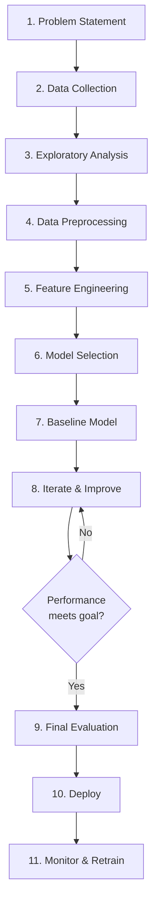

# 05 · ML Pipeline in Practice { #ml-pipeline }

> **Level:** Intermediate to Advanced  
> **Pre-reading:** All previous sections

---

## End-to-End ML Project

Building a real ML system requires:

---

## 1. Problem Statement

Define clearly:
- What are we predicting?
- What data do we have?
- What's success?
- What are constraints?

---

## 2. Data Collection

Gather data:
- Internal logs and databases
- APIs and web scraping
- Crowdsourcing
- Synthetic data generation

Key questions:
- How much data?
- Is it representative?
- Are there biases?

---

## 3. Exploratory Data Analysis (EDA)

Understand your data:

- **Summary statistics:** Mean, median, std, min, max
- **Distributions:** Histograms, box plots
- **Correlations:** Which features relate to target?
- **Missing values:** How many? Random or systematic?
- **Outliers:** Errors or real extreme cases?

---

## 4. Data Preprocessing

Clean and prepare data:

### Handling Missing Values

| Strategy | When to Use |
|:---------|:-----------|
| **Drop** | Few missing values (<5%), not important feature |
| **Fill with mean/median** | Numerical, missing randomly |
| **Fill with mode** | Categorical |
| **Forward/backward fill** | Time-series data |
| **Predictive filling** | Predict from other features |

### Handling Outliers

| Strategy | When to Use |
|:---------|:-----------|
| **Remove** | Clear errors, few outliers |
| **Clip** | Few extreme values |
| **Transform** | Use log or sqrt (reduces impact) |
| **Keep** | Real extreme values (fraud signals, etc.) |

### Data Normalization/Standardization

| Technique | Formula | When |
|:----------|:--------|:-----|
| **Min-Max** | $(x - \min) / (\max - \min)$ | Scale to [0,1] |
| **Z-score** | $(x - \mu) / \sigma$ | Scale to mean 0, std 1 |
| **Log transform** | $\log(x)$ | Reduce skew, outliers |

---

## 5. Feature Engineering

Create meaningful features:

- **Domain knowledge:** Business-relevant features
- **Interactions:** Multiply/divide features
- **Polynomials:** Square, cube features
- **Binning:** Convert continuous to categorical
- **Aggregations:** Time windows, counts

---

## 6. Model Selection

Choose model(s) to try:

| Model Type | When to Use |
|:-----------|:-----------|
| **Linear Regression** | Simple, interpretable, fast |
| **Decision Trees** | Non-linear, handles categories, interpretable |
| **Random Forest** | Robust, handles interactions, less tuning |
| **Neural Networks** | Complex non-linearity, lots of data |
| **Gradient Boosting** | State-of-the-art, competitive models (XGBoost, LightGBM) |

Start simple, increase complexity if needed.

---

## 7. Baseline Model

Create simple baseline (median prediction, simple rule):

Why?
- Provides reference point
- Quick reality check
- Highlights value of complex model

---

## 8. Iterate & Improve

| If Problem | Try |
|:-----------|:----|
| **Underfitting** (high training loss) | Add features, increase model complexity, train longer |
| **Overfitting** (high validation loss) | Add regularization, more data, simpler model |
| **Slow training** | Reduce data size, simpler model, use GPU |
| **Poor on specific examples** | Analyze failing examples, add relevant features |

---

## 9. Final Evaluation

Evaluate on held-out test set:
- Report accuracy, precision, recall, F1
- Create confusion matrix
- Analyze failure cases
- Compare to baseline

---

## 10. Deployment

Put model in production:
- REST API endpoint
- Batch processing
- Embedded model
- A/B testing

---

## 11. Monitoring & Retraining

**Important:** Monitor model performance over time:

- Track prediction accuracy
- Detect data drift (new patterns)
- Retrain periodically
- Set up alerts for performance drop

---

??? question "How much data do I need?"
    Depends on model complexity and problem difficulty. Rules of thumb: 1,000 for simple models, 10,000+ for deep learning. More data always helps.

??? question "What's the train/val/test split?"
    70/15/15 is common. For huge datasets, 99/0.5/0.5 is okay. Never use test set during model development.

??? question "How do I handle imbalanced classes?"
    Oversampling, undersampling, class weights, different metrics (F1, AUC instead of accuracy).

---

--8<-- "_abbreviations.md"

