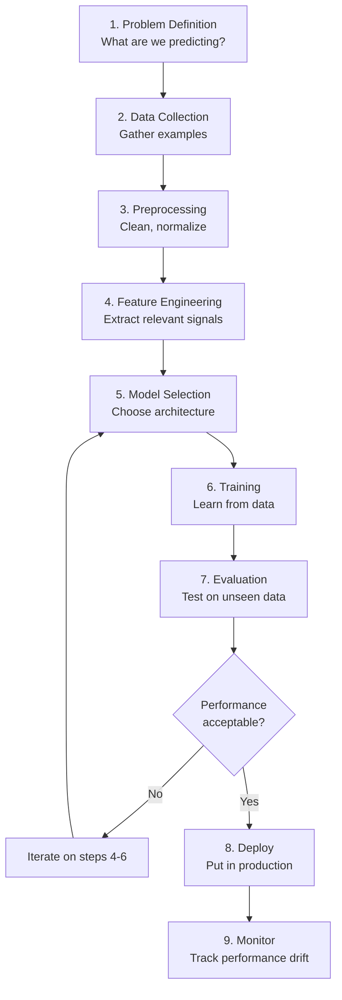
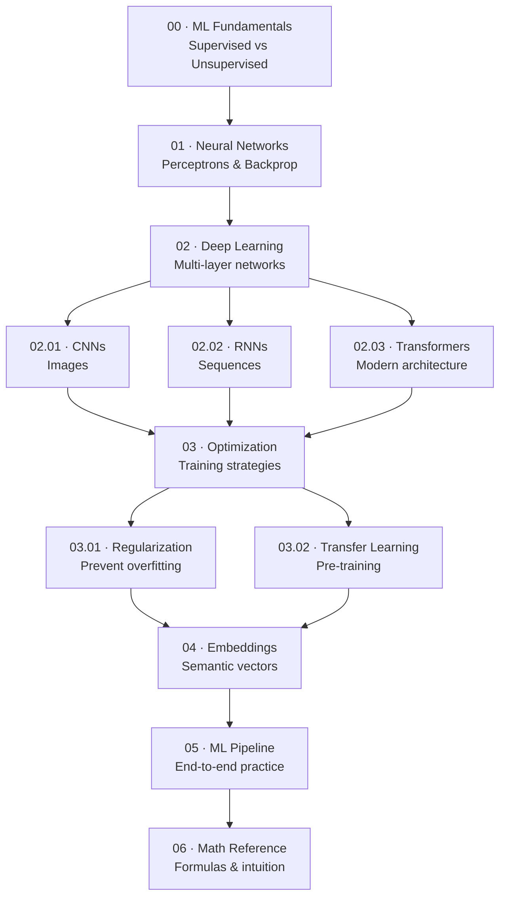

# Machine Learning & Deep Learning Guide

> **A comprehensive learning portal for ML/DL fundamentals, neural networks, deep learning architectures, and mathematical foundations.**  
> Designed for software developers and engineers who want to understand the mathematical and conceptual foundations of machine learning and deep learning before diving into LLMs and agentic AI systems.

---

## What This Guide Covers

This guide builds a solid foundation in machine learning and deep learning from first principles. Rather than jumping straight into LLMs, we cover the essential concepts you need to understand how neural networks learn, why certain architectures work, and how to train and evaluate models effectively.

| Domain | Topics Covered |
|:-------|:--------------|
| **ML Fundamentals** | Supervised/unsupervised learning, the ML pipeline, loss functions, optimization |
| **Neural Networks** | Perceptrons, neurons, activation functions, forward/backward propagation |
| **Deep Learning** | Multi-layer networks, training strategies, avoiding overfitting |
| **Architectures** | CNNs for images, RNNs for sequences, Transformers (foundation of LLMs) |
| **Training** | Gradient descent, momentum, Adam, learning rate scheduling |
| **Regularization** | Dropout, batch norm, L1/L2 penalty, early stopping |
| **Embeddings** | Word2Vec, GloVe, FastText — semantic vector representations |
| **Transfer Learning** | Pre-training and fine-tuning, why it's powerful |
| **Math** | Calculus, linear algebra, probability — as needed |

---

## Why This Matters

Understanding ML/DL fundamentals is critical because:

1. **LLMs are just deep learning models** — knowing how neural networks work helps you understand how LLMs work
2. **You'll debug better** — understanding backprop and loss functions helps diagnose why models fail
3. **You'll make better architectural choices** — knowing trade-offs between CNNs, RNNs, and Transformers
4. **You'll tune hyperparameters effectively** — learning rates, batch sizes, regularization matter
5. **You'll evaluate models properly** — accuracy alone isn't enough; you need precision, recall, F1, AUC

---

## The ML Pipeline at a Glance

Every machine learning project follows a similar flow:

---

## Key Concepts at a Glance

| Concept | What It Means | Why It Matters |
|:--------|:-------------|:--------------|
| **Neuron** | Computational unit: takes inputs, applies weights, adds bias, applies activation | Basic building block of all neural networks |
| **Weight** | Learnable parameter scaling each input | What gets adjusted during training |
| **Bias** | Learnable offset per neuron | Allows threshold shift, often overlooked but important |
| **Activation Function** | Non-linear transformation (ReLU, Sigmoid, Tanh) | Introduces non-linearity, enables learning complex patterns |
| **Loss Function** | Measure of prediction error (MSE, cross-entropy) | What we minimize during training |
| **Gradient** | Direction of steepest increase in loss | Used to update weights via gradient descent |
| **Backpropagation** | Algorithm computing gradients via chain rule | How neural networks learn from errors |
| **Epoch** | One pass through entire training dataset | Progress indicator for training |
| **Batch** | Subset of data processed before updating weights | Affects gradient estimates and memory usage |
| **Overfitting** | Learning training data too well, failing on new data | Main enemy of generalization |
| **Regularization** | Technique preventing overfitting (dropout, L2, early stopping) | Essential for models that generalize well |
| **Embedding** | Dense vector representing semantic meaning | Powers similarity search and semantic understanding |

---

## Core Math You'll Encounter

This guide includes math as needed, using clear notation. You should be familiar with:

- **Linear algebra** — vectors, matrices, dot products
- **Calculus** — derivatives, chain rule (essential for backprop)
- **Probability** — distributions, entropy, cross-entropy

We provide explanations and visual intuition alongside equations so you don't need to memorize formulas.

---

## Learning Path

Follow sections in order if you're new to ML/DL. Jump to specific sections if you have background.

| Step | Section | Goal |
|:-----|:--------|:-----|
| 1 | [ML Fundamentals](00-ml-fundamentals.md) | Understand supervised/unsupervised learning and the ML pipeline |
| 2 | [Neural Networks](01-neural-networks.md) | Understand perceptrons, neurons, and backpropagation |
| 3 | [Deep Learning Overview](02-deep-learning-overview.md) | Understand multi-layer networks and why depth works |
| 4 | [CNN](02.01-cnn.md) | Understand convolutions for image processing |
| 5 | [RNN](02.02-rnn.md) | Understand recurrence for sequence processing |
| 6 | [Transformers](02.03-transformer.md) | Understand self-attention and Transformers (foundation of LLMs) |
| 7 | [Optimization](03-optimization-training.md) | Understand training algorithms and hyperparameters |
| 8 | [Regularization](03.01-regularization.md) | Prevent overfitting and improve generalization |
| 9 | [Transfer Learning](03.02-transfer-learning.md) | Leverage pre-trained models effectively |
| 10 | [Embeddings](04-word-embeddings.md) | Understand semantic vector representations |
| 11 | [ML Pipeline](05-ml-pipeline.md) | Apply all concepts in an end-to-end project |
| 12 | [Math Reference](06-math-reference.md) | Quick reference for formulas and intuitions |

---

## Core Insight

> The power of deep learning comes from **learning hierarchical representations**: lower layers learn low-level features (edges, shapes), middle layers combine them into mid-level features (corners, parts), and top layers learn high-level concepts (objects, classes). This hierarchy emerges automatically during training without explicit programming.

---

## Who This Guide Is For

- **Software engineers** wanting to understand ML/DL before building AI systems
- **Backend developers** preparing to work with LLMs and agentic AI
- **Anyone** wanting to understand the mathematics and intuition behind neural networks
- **Interview candidates** preparing for ML/AI engineer roles

---

## How to Use This Guide

- **If you have zero ML background:** Follow sections 1–12 in order
- **If you know basic ML:** Jump to section 1 (Neural Networks) and continue from there
- **If you know neural networks:** Jump to section 2 (Deep Learning) and focus on architectures
- **If you need quick reference:** Jump to section 6 (Math Reference)

Each section includes:

- Conceptual explanations with diagrams
- Mathematical formulas with intuitive explanations
- Practical examples
- Comparison tables
- Interview questions

---

## Before You Start: Assumed Knowledge

This guide assumes you understand:

- **Basic Python** — can read and write simple functions
- **Basic linear algebra** — vectors, matrices, dot products
- **Basic calculus** — derivatives, understanding what gradients mean
- **Basic probability** — distributions, probability rules

If you need refresher material on any of these, we recommend:

- [3Blue1Brown's Linear Algebra](https://www.youtube.com/c/3Blue1Brown/playlists) — visual intuition
- [3Blue1Brown's Calculus](https://www.youtube.com/c/3Blue1Brown/playlists) — chain rule is essential
- [Khan Academy Probability](https://www.khanacademy.org/math/probability) — fundamentals

---

## 📚 Complete Article Contents

### Section 00: Machine Learning Fundamentals (3 articles)

| Article | Topics |
|---------|--------|
| **00 · ML Fundamentals** | ML pipeline, supervised vs unsupervised, evaluation metrics, loss functions |
| **00.01 · Supervised vs Unsupervised** | Regression, classification, clustering, dimensionality reduction, anomaly detection |
| **00.02 · Core Concepts** | Gradient descent, Adam optimizer, L1/L2 regularization, dropout, batch norm, hyperparameters |

### Section 01: Neural Networks (3 articles)

| Article | Topics |
|---------|--------|
| **01 · Neural Networks** | Neurons, weights, biases, activation functions, fully connected layers |
| **01.01 · Perceptrons & Activation Functions** | Perceptron learning, ReLU, sigmoid, tanh, softmax with detailed comparison |
| **01.02 · Backpropagation** | Chain rule, forward/backward pass, gradient computation, vanishing gradients |

### Section 02: Deep Learning Architectures (4 articles)

| Article | Topics |
|---------|--------|
| **02 · Deep Learning Overview** | Why depth works, hierarchical features, training challenges & solutions |
| **02.01 · Convolutional Neural Networks** | Convolutions, filters, pooling, local connectivity, translation invariance |
| **02.02 · Recurrent Neural Networks** | Recurrence, hidden state, LSTMs, GRUs, bidirectional RNNs |
| **02.03 · Transformers** | **Self-attention, multi-head attention — foundation of modern LLMs!** |

### Section 03: Advanced Topics (3 articles)

| Article | Topics |
|---------|--------|
| **03 · Optimization & Training** | Learning rate scheduling, weight initialization, batch size effects |
| **03.01 · Regularization & Generalization** | Data augmentation, dropout, batch norm, L1/L2, early stopping |
| **03.02 · Transfer Learning** | Pre-training, fine-tuning, LoRA, domain adaptation |

### Section 04: Embeddings (2 articles)

| Article | Topics |
|---------|--------|
| **04 · Word Embeddings** | Dense vectors, semantic similarity, Word2Vec, GloVe, FastText |
| **04.01 · Word Embedding Models** | Skip-gram, CBOW, contextual embeddings (BERT, ELMo) |

### Section 05: Practical ML Pipeline (3 articles)

| Article | Topics |
|---------|--------|
| **05 · ML Pipeline** | End-to-end workflow: problem → deployment (10 phases) |
| **05.01 · Data Preprocessing** | Missing values, scaling, outliers, categorical variables, class imbalance |
| **05.02 · Feature Engineering** | Domain features, interactions, polynomials, binning, feature selection |

### Section 06–07: Reference & Interview (2 articles)

| Article | Topics |
|---------|--------|
| **06 · Mathematical Reference** | Linear algebra, calculus, probability, loss functions, optimization, metrics |
| **07 · Interview Q&A** | **50+ questions** organized by topic: fundamentals, optimization, architectures, evaluation |

---

## 📊 Content Statistics

- **24 comprehensive articles** (7 main + 17 deep-dives)
- **50+ interview questions** with detailed answers
- **70+ glossary terms** with hover tooltips
- **30+ Mermaid diagrams** for architecture and workflows
- **50+ mathematical formulas** with MathJax
- **5,000+ lines** of carefully crafted documentation

---

## 🎯 How to Use This Guide

### For Learning
1. Start with **Section 00** (ML fundamentals)
2. Progress through **Sections 01–02** (neural networks and deep learning)
3. Deepen your understanding with **Sections 03–04** (optimization and embeddings)
4. Apply concepts with **Section 05** (ML pipeline)
5. Reference **Section 06** as needed
6. Prepare with **Section 07** for interviews

### For Quick Reference
- Use the sidebar to jump to any section
- Hover over **underlined terms** to see glossary definitions
- Read main articles for breadth, deep-dives for depth
- Check **Section 06** for mathematical formulas
- Review **Section 07** for common interview questions

### For Teaching Others
- Share specific articles or deep-dives
- Use Mermaid diagrams to explain architectures
- Reference interview questions for knowledge checks

---

## 🚀 Next Steps

→ **[Start Here: ML Fundamentals](00-ml-fundamentals.md)** — Supervised learning, unsupervised learning, the ML pipeline  
→ **[Then: Neural Networks](01-neural-networks.md)** — Perceptrons, activation functions, backpropagation  
→ **[Then: Deep Learning Architectures](02-deep-learning-overview.md)** — Why depth works, multi-layer networks

---

--8<-- "_abbreviations.md"--8<-- "_abbreviations.md"

